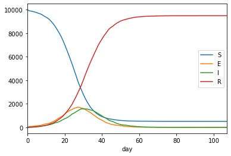

=========================
Getting Started in Python
=========================

Prerequisites
-------------

First, you need to start an interactive Python session using a Python
interpreter with which MetaWards has been installed. To make this easier,
MetaWards comes with two applications; ``metawards-python`` and
``metawards-jupyter``, that will start an interative python or jupyter
session using the python interpreter used by MetaWards.

To start this, e.g. running a jupyter notebook, type;

.. code-block:: bash

   metawards-jupyter notebook

This should open a Jupyter notebook session in your browser. In here,
click "New" to start a new Python3 notebook, and then type the
commands for MetaWards below in the Jupyter cells.

You will also need to import pandas, as we will use this for
analysing and plotting the results.

.. code-block:: python

   >>> import pandas as pd

Importing metawards
-------------------

First we need to import the :mod:`metawards` Python module. To do this
we just need to type;

.. code-block:: python

   >>> import metawards as mw

The module comes with lots of help documentation, so feel free to use
that and tab-completion to explore the module.

Creating the disease
--------------------

You should now be in a Jupyter notebook (or ipython session) and have
imported :mod:`metawards`.

To run a simulation you need to define the :class:`~metawards.Disease`
that you want to model. MetaWards implements a SEIR-style model, but
you have complete control to define as many (or few) stages as you wish.

First, we will create a disease, which we will call ``lurgy``, that
will consist of four stages: S, E, I and R. To do this, let's create
the disease;

.. code-block:: python

   >>> lurgy = mw.Disease(name="lurgy")

Next, we will add each stage. You don't define the "S" stage, as the model
starts with a set of susceptible individuals by default. Instead, we need
to add in the E, I and R stages.

First, lets add the latent ("E") stage. Latent individuals are not
infectious, and so we will set ``beta`` (the infectivity parameter) to 0.0.
Individuals will progress quickly through this stage, so we will set
``progress`` to 0.5, meaning that 50% of individuals move to
the next stage each day.

.. code-block:: python

   >>> lurgy.add("E", beta=0.0, progress=0.5)

Next we will add the infectious ("I") stage. This will have a high ``beta``
value (0.8), but a lower progress (0.25) as we will model this as a
disease with a long symptomatic period.

.. code-block:: python

   >>> lurgy.add("I", beta=0.8, progress=0.25)

Finally, we need to add the recovered ("R") stage. We don't need to set the
``beta`` or ``progress`` values, as MetaWards will automatically recognise
this as the recovered state, and will set ``beta`` to 0 and ``progress``
to 0 automatically.

.. code-block:: python

   >>> lurgy.add("R")

You can should print this disease to the screen to confirm that everything
has been correctly set.

.. code-block:: python

   >>> print(lurgy)

   * Disease: lurgy
   * stage: ['E', 'I', 'R']
   * mapping: ['E', 'I', 'R']
   * beta: [0, 0.8, 0]
   * progress: [0.5, 0.25, 0]
   * too_ill_to_move: [0, 0, 0]
   * start_symptom: 2

.. note::

   You can save this disease to a file using
   ``lurgy.to_json("lurgy.json.bz2")``, and then load it back
   using ``lurgy = metawards.Disease.from_json("lurgy.json.bz2")``

Creating the wards (network)
----------------------------

Next, you need to define the wards (network) that will contain the individuals
who will experience the model outbreak.

We will first start with a single ward, called home.

.. code-block:: python

   >>> home = mw.Ward(name="home")

MetaWards works by assigning individuals as either `workers` or `players`.
The difference is that `workers` make fixed (predictable) movements
between different wards each day, while `players` make random movements.
Since we have just a single ward, we will start by populating it
with 10,000 players.

.. code-block:: python

   >>> home.set_num_players(10000)
   >>> print(home)

   Ward( info=home, num_workers=0, num_players=10000 )

.. note::

   You can save this Ward to a file using
   ``home.to_json("home.json.bz2")``, and then load it back
   using ``home = metawards.Ward.from_json("home.json.bz2")``

Running the model
-----------------

Now we have a disease and a network, we can now model an outbreak. To do this,
we will use the :func:`metawards.run` function.

.. code-block:: python

   >>> results = metawards.run(model=home, disease=lurgy)

This will print a lot to the screen. The key lines are these;

::

    ━━━━━━━━━━━━━━━━━━━━━━━━━━━━━━━━━━━━ Day 0 ━━━━━━━━━━━━━━━━━━━━━━━━━━━━━━━━━━━━━
    S: 10000  E: 0  I: 0  R: 0  IW: 0  POPULATION: 10000

    ━━━━━━━━━━━━━━━━━━━━━━━━━━━━━━━━━━━━ Day 1 ━━━━━━━━━━━━━━━━━━━━━━━━━━━━━━━━━━━━━
    S: 10000  E: 0  I: 0  R: 0  IW: 0  POPULATION: 10000
    Number of infections: 0

    ━━━━━━━━━━━━━━━━━━━━━━━━━━━━━━━━━━━━ Day 2 ━━━━━━━━━━━━━━━━━━━━━━━━━━━━━━━━━━━━━
    S: 10000  E: 0  I: 0  R: 0  IW: 0  POPULATION: 10000
    Number of infections: 0

    ━━━━━━━━━━━━━━━━━━━━━━━━━━━━━━━━━━━━ Day 3 ━━━━━━━━━━━━━━━━━━━━━━━━━━━━━━━━━━━━━
    S: 10000  E: 0  I: 0  R: 0  IW: 0  POPULATION: 10000
    Number of infections: 0

    ━━━━━━━━━━━━━━━━━━━━━━━━━━━━━━━━━━━━ Day 4 ━━━━━━━━━━━━━━━━━━━━━━━━━━━━━━━━━━━━━
    S: 10000  E: 0  I: 0  R: 0  IW: 0  POPULATION: 10000
    Number of infections: 0

    ━━━━━━━━━━━━━━━━━━━━━━━━━━━━━━━━━━━━ Day 5 ━━━━━━━━━━━━━━━━━━━━━━━━━━━━━━━━━━━━━
    S: 10000  E: 0  I: 0  R: 0  IW: 0  POPULATION: 10000
    Number of infections: 0
    Ending on day 5

This shows the number of people in the different stages of the outbreak.
In this case, there was no infection seeded, and so the number of infections
remained zero.

Seeding the outbreak
--------------------

We need to seed the outbreak with some additional seeds. We do this using
the ``additional`` option. This can be very powerful (e.g. adding seeds
at different days, different wards etc.), but at its simplest, it is
just the number of initial infections on the first day in the first
ward. We will start with 100 initial infections;

.. code-block:: python

   >>> results = metawards.run(model=home, disease=lurgy, additional=100)

Now you get a lot more output, e.g. for me the outbreak runs for 75 days.

::

    ━━━━━━━━━━━━━━━━━━━━━━━━━━━━━━━━━━━━ Day 70 ━━━━━━━━━━━━━━━━━━━━━━━━━━━━━━━━━━━━
    S: 423  E: 0  I: 1  R: 9576  IW: 0  POPULATION: 10000
    Number of infections: 1

    ━━━━━━━━━━━━━━━━━━━━━━━━━━━━━━━━━━━━ Day 71 ━━━━━━━━━━━━━━━━━━━━━━━━━━━━━━━━━━━━
    S: 423  E: 0  I: 1  R: 9576  IW: 0  POPULATION: 10000
    Number of infections: 1

    ━━━━━━━━━━━━━━━━━━━━━━━━━━━━━━━━━━━━ Day 72 ━━━━━━━━━━━━━━━━━━━━━━━━━━━━━━━━━━━━
    S: 423  E: 0  I: 1  R: 9576  IW: 0  POPULATION: 10000
    Number of infections: 1

    ━━━━━━━━━━━━━━━━━━━━━━━━━━━━━━━━━━━━ Day 73 ━━━━━━━━━━━━━━━━━━━━━━━━━━━━━━━━━━━━
    S: 423  E: 0  I: 1  R: 9576  IW: 0  POPULATION: 10000
    Number of infections: 1

    ━━━━━━━━━━━━━━━━━━━━━━━━━━━━━━━━━━━━ Day 74 ━━━━━━━━━━━━━━━━━━━━━━━━━━━━━━━━━━━━
    S: 423  E: 0  I: 1  R: 9576  IW: 0  POPULATION: 10000
    Number of infections: 1

    ━━━━━━━━━━━━━━━━━━━━━━━━━━━━━━━━━━━━ Day 75 ━━━━━━━━━━━━━━━━━━━━━━━━━━━━━━━━━━━━
    S: 423  E: 0  I: 0  R: 9577  IW: 0  POPULATION: 10000
    Number of infections: 0
    Ending on day 75

Visualising the results
-----------------------

The output ``results`` contains the filename of a csv file that contains
the S, E, I and R data (amongst other things). You can load and plot this
using standard R commands, e.g.

.. code-block:: python

   >>> df = pd.read_csv(results)
   >>> print(df)

        fingerprint  repeat  day        date      S    E   I     R  IW  SCALE_UV
    0        REPEAT       1    0  2020-07-21  10000    0   0     0   0       1.0
    1        REPEAT       1    1  2020-07-22   9900   76  24     0   1       1.0
    2        REPEAT       1    2  2020-07-23   9878   79  39     4   1       1.0
    3        REPEAT       1    3  2020-07-24   9840   95  49    16   1       1.0
    4        REPEAT       1    4  2020-07-25   9800  111  59    30   1       1.0
    ..          ...     ...  ...         ...    ...  ...  ..   ...  ..       ...
    103      REPEAT       1  103  2020-11-01    511    0   1  9488   0       1.0
    104      REPEAT       1  104  2020-11-02    511    0   1  9488   0       1.0
    105      REPEAT       1  105  2020-11-03    511    0   1  9488   0       1.0
    106      REPEAT       1  106  2020-11-04    511    0   1  9488   0       1.0
    107      REPEAT       1  107  2020-11-05    511    0   0  9489   0       1.0

    [108 rows x 10 columns]

We can visualise the data using;

.. code-block:: python

   >>> df.plot.line(x="day", y=["S","E","I","R"])

The result should look something like this;

Complete code
-------------

The complete Python code for this part of the getting started guide is
re-copied below;

.. code-block:: python

   # import the required modules
   import pandas as pd
   import metawards as mw

   # create the disease
   lurgy = mw.Disease(name="lurgy")
   lurgy.add("E", beta=0.0, progress=0.25)
   lurgy.add("I", beta=0.8, progress=0.25)
   lurgy.add("R")

   # create the wards network
   home = mw.Ward(name="home")
   home.set_num_players(10000)

   # run the model
   results = metawards.run(model=home, disease=lurgy, additional=100)

   # load and graph the results
   df = pd.read_csv(results)
   df.plot.line(x="day", y=["S","E","I","R"])

