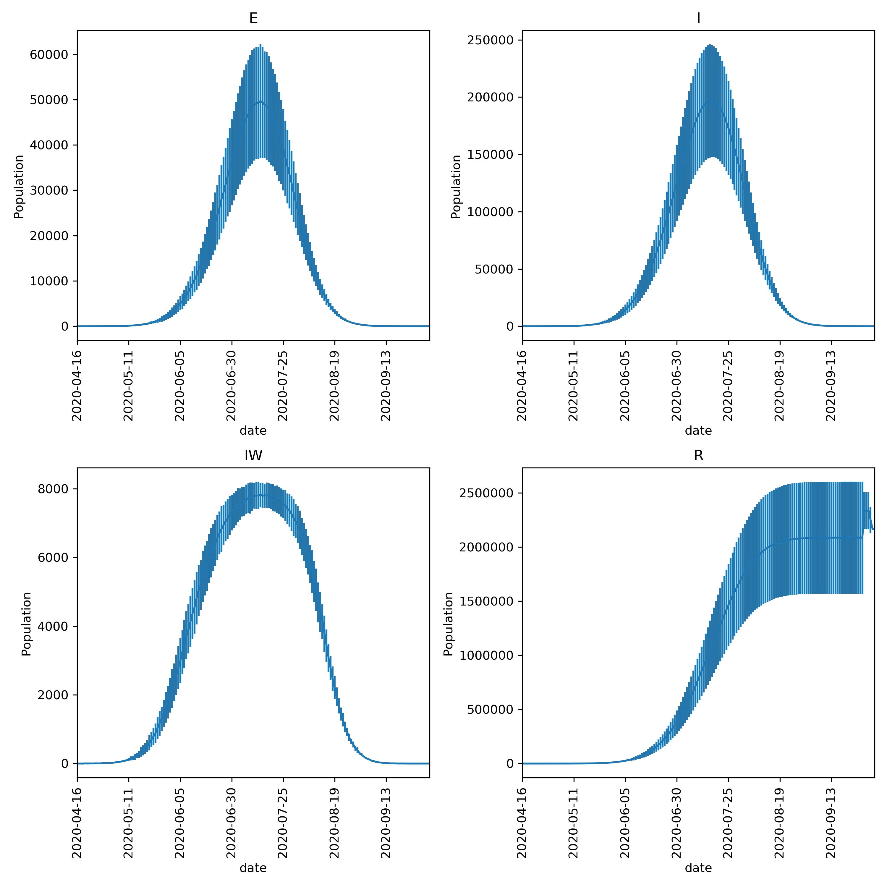

================
Plotting outputs
================

You should now have a ``results.csv.bz2`` file in the ``output`` directory,
which contains the results of four *model runs* of the outbreak of the
lurgy that was seeded in London.

You can plot graphs of the result using the
:doc:`metawards-plot <../../metawards_plot_help>` command.
To run this, type;

.. code-block:: bash

   metawards-plot --input output/results.csv.bz2

This will create two sets of graphs;

* ``output/overview.pdf``
    This is an overview of the **E**, **I**, **IW** and **R** values
    from each day of the model outbreak for each of the four *model runs*.
    Your graph should look something like this;

.. image:: ../../images/tutorial_1_3_overview.jpg
   :alt: Overview image of the outbreak of the lurgy

* ``output/average.pdf``
    This shows the average of the **E**, **I**, **IW** and **R** values,
    with the standard deviation shown as the error bars. Your graph should
    look something like this;

.. note::

    Your graphs may look a little different in the exact numbers, but should
    be similar in shape. The purpose of this type of modelling is not to
    make exact numerical predictions, but to instead understand trends
    and timelines.

The ``metawards-plot`` command can be used for quick-and-simple plots.
If you want something more complex then you can take a look at the functions
in the `metawards.analysis` module. In addition, we have a
:download:`Jupyter notebook <../../notebooks/1_3_plotting.ipynb>`
which you can look at which breaks down exactly how ``metawards-plot``
uses pandas and matplotlib to render these two graphs.
