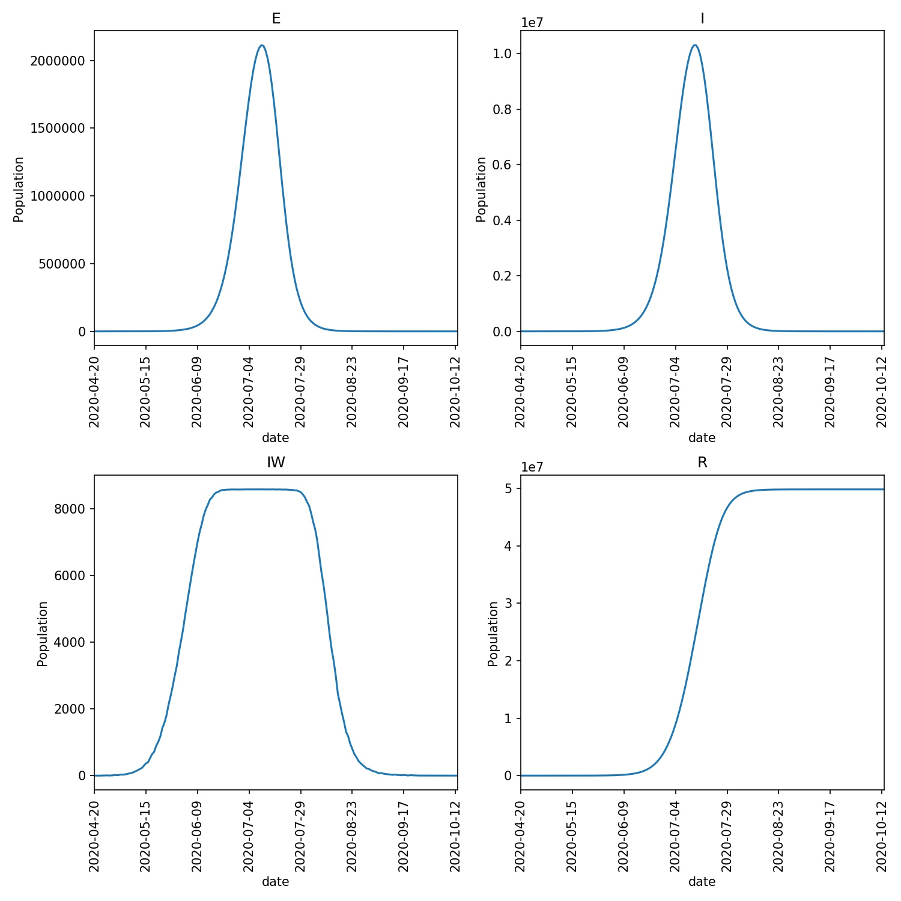

==========================
Refining the disease model
==========================

In the last part of the tutorial you plotted graphs that showed the progress
of the lurgy across four *model runs* of the outbreak which were seeded
in London.

While this was good, the *model runs* were performed using an initial,
possibly poor model of the lurgy. Our next step is to customise the
``disease file`` to build a more representative model.

Understanding the disease file
------------------------------

The model of the lurgy is based on the
`disease file <https://github.com/metawards/MetaWardsData/blob/master/diseases/lurgy.json>`__
contained in the
`MetaWardsData <https://github.com/metawards/MetaWardsData>`__ repository.

The first step to customise this file is to copy it into our current
directory and rename it to ``lurgy2.json``.
Assuming you have set the ``METAWARDSDATA`` environment
variable equal to the path to this directory, type;

.. code-block:: bash

  cp $METAWARDSDATA/diseases/lurgy.json ./lurgy2.json

on Linux or Mac OS X, or type;

.. code-block:: bash

  copy $Env:METAWARDSDATA\diseases\lurgy.json lurgy2.json

on Windows.

.. note::
   The above command work on Linux, Mac (OS X) or Windows. If you are following
   this tutorial using a different operating system and know the correct
   copy command to use, then please send it to us by sending us a
   `pull request <https://github.com/metawards/MetaWards>`__
   or `posting an issue <https://github.com/metawards/MetaWards/issues>`__.

The disease file for the lurgy looks like the following;

::

  { "name"             : "The Lurgy",
    "version"          : "April 16th 2020",
    "author(s)"        : "Christopher Woods",
    "contact(s)"       : "christopher.woods@bristol.ac.uk",
    "reference(s)"     : "Completely ficticious disease - no references",
    "beta"             : [0.0, 0.0, 0.5, 0.5, 0.0],
    "progress"         : [1.0, 1.0, 0.5, 0.5, 0.0],
    "too_ill_to_move"  : [0.0, 0.0, 0.5, 0.8, 1.0],
    "contrib_foi"      : [1.0, 1.0, 1.0, 1.0, 0.0]
  }

The file is in `JSON <https://en.wikipedia.org/wiki/JSON>`__ format. This
is easy for computers to read, and relatively easy for us to read too ;-)

Notice that the file contains metadata, e.g. **version**, **author(s)**,
**references** that embed some extra context into where the data for
this file comes from. Feel free to edit the file and add your metadata.

The key parameters for the disease are the set of numbers associated
with **beta**, **progress**, **too_ill_to_move** and **contrib_foi**.

These lists provide the values for those parameters in the model for the
different stages of the disease. In this case, the lurgy has five
stages (also called classes). An individual who is infected progresses
along each stage (or class) in turn according to the value of the parameters;

* **beta** - the rate of infection of the disease. For the first two stages
  the value of **beta** is zero, meaning that infected individuals are
  not infectious. However, individuals are infectious in stages three
  and four, when **beta** is 0.5. The final fifth stage is when the individual
  is removed from the outbreak, when the **beta** value is zero again.

* **progess** - rate of progression of an individual through the stages
  of the disease. Individuals progress quickly through the first two
  stages (where **progress** is 1.0), and then progress slows down
  in the third and fourth stages (**progress** is 0.5). The fifth stage
  is the final stage, and so the **progress** value is zero.

* **too_ill_to_move** - the proportion of infected individuals who are
  unable to move. This starts low in the initial stages, e.g. at
  stage three individuals can move (**too_ill_to_move** is 0.5) and
  are quite infectious (**beta** is 0.5). This progresses up to 1.0
  for the final stage, when the individual is removed from the oubreak.

* **contrib_foi** - this is how much the infected individuals contribute
  to the force of infection in their home electoral ward or during
  their work commute. In this case, individuals infected with
  this model lurgy contribute fully (**contrib_foi** is 1.0) for all
  but the final stage, when they are removed from the outbreak.

Modifying the disease file
--------------------------

With the current model, the lurgy only becomes infectious when
the infected individual are already showing symptoms and have
reduced mobility. For the lurgy that we want to model we need to
represent the lurgy as a disease that is infectious for a period
of time before the individual is showing symptoms. To this end,
we will an extra stage in the middle for which **beta** is high
but **too_ill_to_move** is still zero. Edit your copy of
``lurgy2.json`` to read;

::

  { "name"             : "The Lurgy",
    "version"          : "April 16th 2020",
    "author(s)"        : "Christopher Woods",
    "contact(s)"       : "christopher.woods@bristol.ac.uk",
    "reference(s)"     : "Completely ficticious disease - no references",
    "beta"             : [0.0, 0.0, 0.5, 0.5, 0.5, 0.0],
    "progress"         : [1.0, 1.0, 1.0, 0.5, 0.5, 0.0],
    "too_ill_to_move"  : [0.0, 0.0, 0.0, 0.5, 0.8, 1.0],
    "contrib_foi"      : [1.0, 1.0, 1.0, 1.0, 1.0, 0.0]
  }

Once you have saved the file you can perform a single *model run*
using this file via;

.. code-block:: bash

   metawards -d lurgy2 -a ExtraSeedsLondon.dat

.. note::

  ``metawards`` automatically used your ``lurgy2.json`` file as it
  found the file in your current directory. You can pass a full path to
  your file, with or without the ``.json`` extension

This will run the ``metawards`` *model run* for your new version of the
lurgy. Notice that near the top of the output you have your parameters
and the metadata printed to the screen, e.g.

::

    ━━━━━━━━━━━━━━━━━━━━━━━━━━━━━━━━━━━━━━━━ Disease ━━━━━━━━━━━━━━━━━━━━━━━━━━━━━━━━━━━━━━━━━

    • Disease: lurgy2
    • loaded from: lurgy2.json
    • repository: /Users/chris/GitHub/MetaWardsData
    • repository_branch: None
    • repository_version: None
    • beta: [0.0, 0.0, 0.5, 0.5, 0.5, 0.0]
    • progress: [1.0, 1.0, 1.0, 0.5, 0.5, 0.0]
    • too_ill_to_move: [0.0, 0.0, 0.0, 0.5, 0.8, 1.0]
    • contrib_foi: [1.0, 1.0, 1.0, 1.0, 1.0, 0.0]
    • start_symptom: 3

Again, this helps someone reproduce this output in the future.

This model run may take longer, as, intuitively, you would expect that
the changes we have made mean that more individuals are likely to be
infected. Indeed, for the run I performed, copied below,
the outbreak lasted for 196 days, involving nearly 50m individuals.

::

    ━━━━━━━━━━━━━━━━━━━━━━━━━━━━━━━━━━━━━━━━ Day 189 ━━━━━━━━━━━━━━━━━━━━━━━━━━━━━━━━━━━━━━━━━
    S: 6225870  E: 1  I: 3  R: 49856203  IW: 0  POPULATION: 56082077
    Number of infections: 4

    ━━━━━━━━━━━━━━━━━━━━━━━━━━━━━━━━━━━━━━━━ Day 190 ━━━━━━━━━━━━━━━━━━━━━━━━━━━━━━━━━━━━━━━━━
    S: 6225870  E: 0  I: 2  R: 49856205  IW: 0  POPULATION: 56082077
    Number of infections: 2

    ━━━━━━━━━━━━━━━━━━━━━━━━━━━━━━━━━━━━━━━━ Day 191 ━━━━━━━━━━━━━━━━━━━━━━━━━━━━━━━━━━━━━━━━━
    S: 6225870  E: 0  I: 2  R: 49856205  IW: 0  POPULATION: 56082077
    Number of infections: 2

    ━━━━━━━━━━━━━━━━━━━━━━━━━━━━━━━━━━━━━━━━ Day 192 ━━━━━━━━━━━━━━━━━━━━━━━━━━━━━━━━━━━━━━━━━
    S: 6225870  E: 0  I: 2  R: 49856205  IW: 0  POPULATION: 56082077
    Number of infections: 2

    ━━━━━━━━━━━━━━━━━━━━━━━━━━━━━━━━━━━━━━━━ Day 193 ━━━━━━━━━━━━━━━━━━━━━━━━━━━━━━━━━━━━━━━━━
    S: 6225870  E: 0  I: 2  R: 49856205  IW: 0  POPULATION: 56082077
    Number of infections: 2

    ━━━━━━━━━━━━━━━━━━━━━━━━━━━━━━━━━━━━━━━━ Day 194 ━━━━━━━━━━━━━━━━━━━━━━━━━━━━━━━━━━━━━━━━━
    S: 6225870  E: 0  I: 2  R: 49856205  IW: 0  POPULATION: 56082077
    Number of infections: 2

    ━━━━━━━━━━━━━━━━━━━━━━━━━━━━━━━━━━━━━━━━ Day 195 ━━━━━━━━━━━━━━━━━━━━━━━━━━━━━━━━━━━━━━━━━
    S: 6225870  E: 0  I: 1  R: 49856206  IW: 0  POPULATION: 56082077
    Number of infections: 1

    ━━━━━━━━━━━━━━━━━━━━━━━━━━━━━━━━━━━━━━━━ Day 196 ━━━━━━━━━━━━━━━━━━━━━━━━━━━━━━━━━━━━━━━━━
    S: 6225870  E: 0  I: 0  R: 49856207  IW: 0  POPULATION: 56082077
    Number of infections: 0
    Infection died ... Ending on day 197

An overview plot of the outbreak, created using

.. code-block:: bash

  metawards-plot -i output/results.csv.bz2

shows the much higher peak of the outbreak compared to our original
model of the lurgy.

