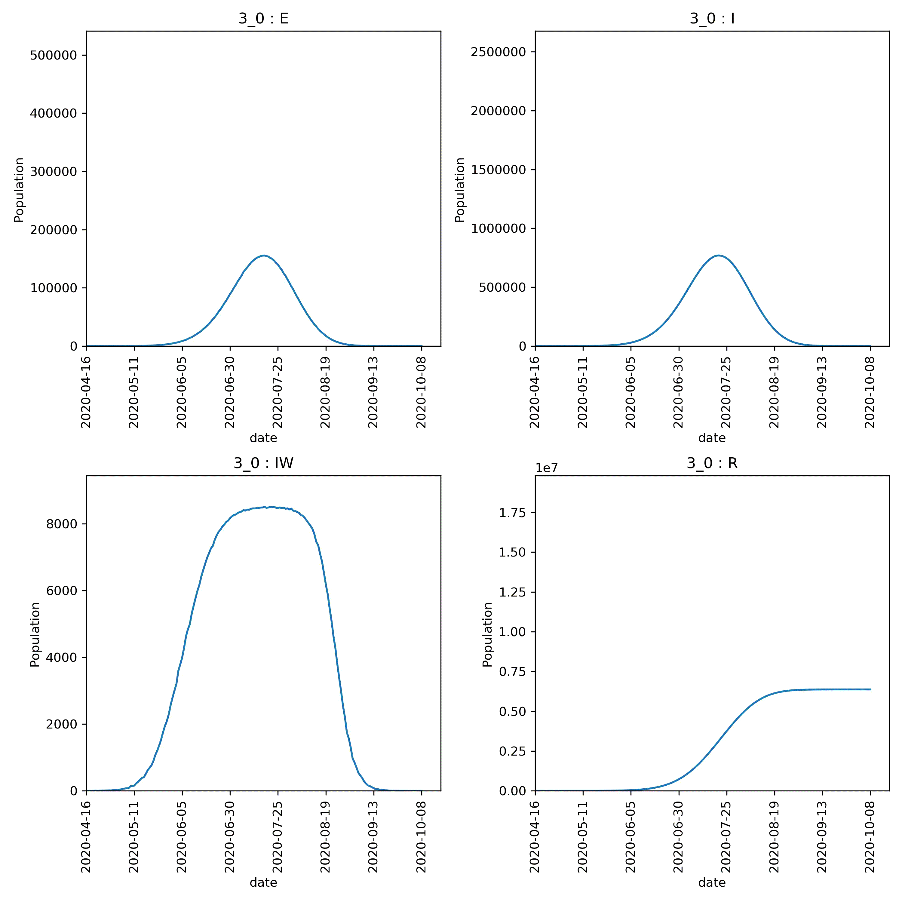

====================
Analysing the output
====================

The ``results.csv.bz2`` file contains all of the population trajectories
from the nine model runs. You can explore this using Python pandas, R,
or Excel :doc:`as you did before <../part01/02_repeating>`. Using
ipython or Jupyter notebooks with pandas, we can load up the file;

.. code-block:: python

   >>> import pandas as pd
   >>> df = pd.read_csv("output/results.csv.bz2")
   >>> print(df)
        fingerprint  repeat  beta[2]  too_ill_to_move[2]  day  ...         S  E  I         R  IW
   0            3_0       1      0.3                 0.0    0  ...  56082077  0  0         0   0
   1            3_0       1      0.3                 0.0    1  ...  56082077  0  0         0   0
   2            3_0       1      0.3                 0.0    2  ...  56082072  5  0         0   0
   3            3_0       1      0.3                 0.0    3  ...  56082072  0  5         0   0
   4            3_0       1      0.3                 0.0    4  ...  56082071  0  5         1   1
   ...          ...     ...      ...                 ...  ...  ...       ... .. ..       ...  ..
   1764         5_5       1      0.5                 0.5  172  ...   6304109  0  5  49777963   0
   1765         5_5       1      0.5                 0.5  173  ...   6304109  0  4  49777964   0
   1766         5_5       1      0.5                 0.5  174  ...   6304109  0  3  49777965   0
   1767         5_5       1      0.5                 0.5  175  ...   6304109  0  1  49777967   0
   1768         5_5       1      0.5                 0.5  176  ...   6304109  0  0  49777968   0

   [1769 rows x 11 columns]

This is very similar to before, except now we have extra columns giving
the values of the variables that are being adjusted (columns
``beta[2]`` and ``too_ill_to_move[2]``. We also now have a use for the
``fingerprint`` column, which contains a unique identifier for each
pair of adjustable variables.

.. note::
   The fingerprint is constructed by removing the leading ``0.`` from
   the value of the adjustable variable, and the joining the values
   together using underscores. Thus ``0.3  0.0`` becomes ``3_0``,
   while ``0.5 0.5`` becomes ``5_5``.

Finding peaks
-------------

We can use ``.groupby`` to group the results with the same fingerprint
together. Then the ``.max`` function can be used to show the maximum
values of selected columns from each group, e.g.

.. code-block:: python

  >>> df.groupby("fingerprint")[["day", "E","I", "IW", "R"]].max()
                day        E         I    IW         R
   fingerprint
   3_0          204  1767303   8665472  8588  48105748
   3_25         205  1908160   9296754  8588  48076343
   3_5          215  1844377   9024418  8588  48036902
   4_0          192  1947245   9532789  8588  49042717
   4_25         210  1965166   9614400  8588  49009034
   4_5          200  2095342  10179621  8588  48975523
   5_0          175  2207896  10714530  8588  49857969
   5_25         183  2120481  10326984  8588  49821966
   5_5          176  2117730  10330952  8588  49777968

From this, we can see that higher peaks occured for higher values
of **beta**, which is expected. However, different values of
**too_ill_to_move** had little impact on the peaks.

.. warning::

  Do not over-interpret the results of single runs, such as the above.
  There is a lot of random
  error in these calculations and multiple *model runs* must be
  averaged over to gain a good understanding.

Plotting the output
-------------------

There are lots of plots you would likely want to draw, so it is recommended
that you use a tool such as R, Pandas or Excel to create the plots that
will let you explore the data in full. For a quick set of plots, you
can again use ``metawards-plot`` to generate some overview plots. To
do this type;

.. code-block:: bash

  metawards-plot -i output/results.csv.bz2 --format jpg --dpi 150

.. note::
   We have used the 'jpg' image format here are we want to create animations.
   You can choose from many different formats, e.g. 'pdf' for publication
   quality graphs, 'png' etc. Use the ``--dpi`` option to set the
   resolution when creating bitmap (png, jpg) images.

As there are multiple fingerprints, this will produce multiple overview
graphs (one overview per fingerprint, and if you have run multiple
repeats, then one average per fingerprint too).

The fingerprint value is included in the graph name, and they will
all be plotted on the same axes. This means that they could be joined
together into an animation. As well as plotting, ``metawards-plot`` has
an animation mode that can be used to join images together. To run this,
use;

.. code-block:: bash

  metawards-plot --animate output/overview*.jpg

.. note::
   You can only animate image files (e.g. jpg, png). You can't animate
   pdfs (yet - although
   `pull requests welcome <https://github.com/metawards/MetaWards/pulls>`__)

Here is the animation.

Jupyter notebook
----------------

In addition, to the ``metawards-plot`` command, we also have a
:download:`Jupyter notebook <../../notebooks/2_3_analysis.ipynb>`
which you can look at which breaks down exactly how ``metawards-plot``
uses pandas and matplotlib to render multi-fingerprint graphs.
