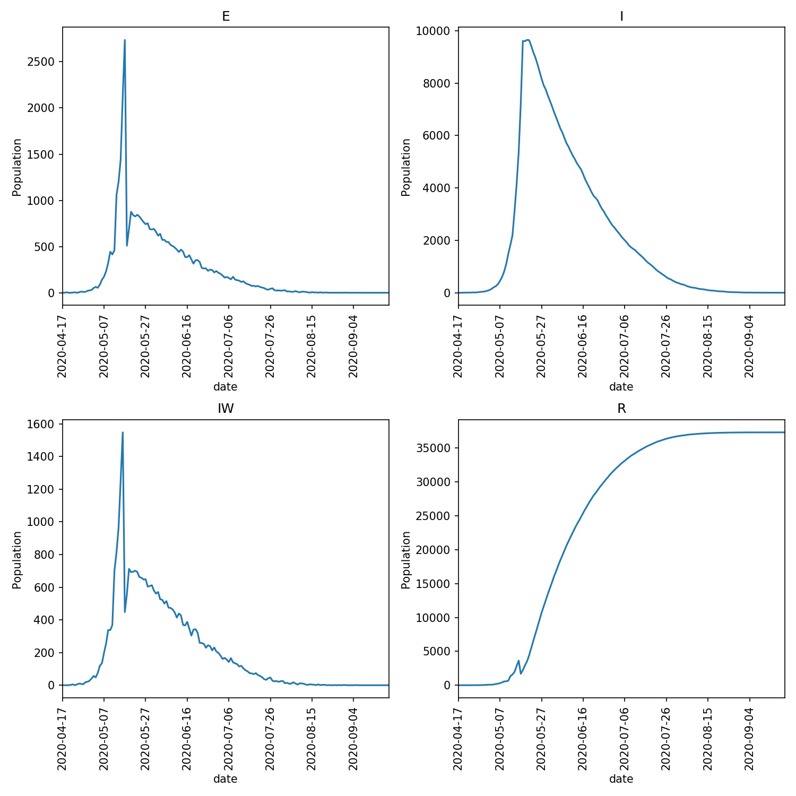
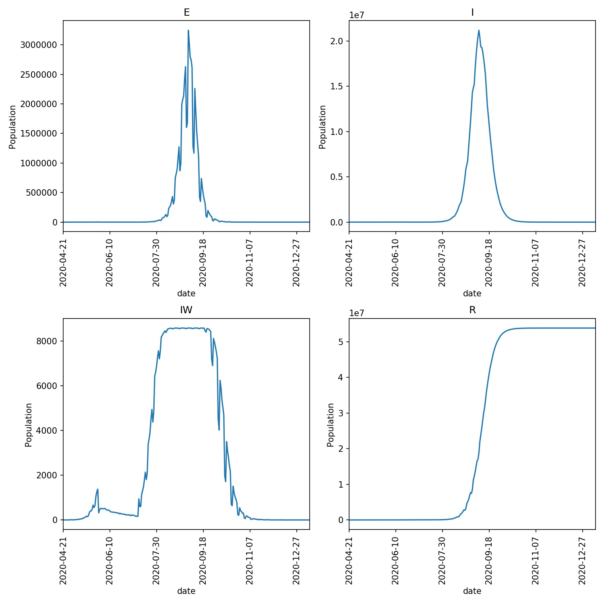

=================================
Responding to changing conditions
=================================

We've now created a lock-down advance function, but are currently
triggering this function in an iterator based on a fixed number
of days since the outbreak started.

A better approach would be to trigger the lock-down based on the
number of individuals who are detected as infected in the model.

To do this, edit your ``lockdown.py`` script and copy in the following;

.. code-block:: python

  from metawards.iterators import iterate_working_week, \
                                  advance_infprob, \
                                  advance_fixed, \
                                  advance_play

  def advance_lockdown(**kwargs):
      print("We are on lockdown")
      advance_infprob(scale_rate=0.25, **kwargs)
      advance_play(**kwargs)

  def iterate_lockdown(population, **kwargs):
      if not hasattr(population, "lockdown_state"):
          population.lockdown_state = "before"
          population.is_locked_down = False

      if population.lockdown_state == "before":
          if population.total > 5000:
              population.lockdown_state = "lockdown"
              population.lockdown_started = population.day
              population.is_locked_down = True

      if population.is_locked_down:
          return [advance_lockdown]
      else:
          return iterate_working_week(population=population,
                                      **kwargs)

The first thing we do here is see if the ``population`` has a
``lockdown_state`` variable using the standard Python
`hasattr function <https://docs.python.org/3/library/functions.html#hasattr>`__.
This variable won't exist on the first call to
to ``iterate_lockdown``, and so here we
set the ``lockdown_state`` to ``before``
and set the flag ``population.is_locked_down`` to ``False``.

Next, we check if the lockdown is in the ``before`` state. If it is,
then if the total infected population is greater than 5000 we change
the ``lockdown_state`` to ``lockdown``, save the day the lockdown
started to ``population.lockdown_started``, and set the flag
``population.is_locked_down`` to ``True``.

Finally, we either return our ``advance_lockdown`` advance function,
or the standard advance functions for a working week depending
on the value of the ``population.is_locked_down`` flag.

Run the model and draw the overview graph using;

.. code-block:: bash

  metawards -d lurgy3 --additional ExtraSeedsLondon.dat --iterator lockdown
  metawards-plot -i output/results.csv.bz2 --format jpg --dpi 150

You should now see that the lockdown takes effect some time after the
infected population grows above 5000. This tips the curve and reduces
the spread of the disease. You can see what my graphs looked like here;

Releasing lockdown
------------------

We can use the data in ``population`` to decide when to release the
lockdown as well. For example, we could release when the size of the
infected population drops below 2000. To do this, edit your ``lockdown.py``
file to read;

.. code-block:: python

  from metawards.iterators import iterate_working_week, \
                                  advance_infprob, \
                                  advance_fixed, \
                                  advance_play

  def advance_lockdown(**kwargs):
      print("We are on lockdown")
      advance_infprob(scale_rate=0.25, **kwargs)
      advance_play(**kwargs)

  def iterate_lockdown(population, **kwargs):
      if not hasattr(population, "lockdown_state"):
          population.lockdown_state = "before"
          population.is_locked_down = False

      if population.lockdown_state == "before":
          if population.total > 5000:
              population.lockdown_state = "lockdown"
              population.lockdown_started = population.day
              population.is_locked_down = True

      elif population.lockdown_state == "lockdown":
          if population.total < 2000:
              population.lockdown_state = "after"
              population.lockdown_ended = population.day
              population.is_locked_down = False

      if population.is_locked_down:
          return [advance_lockdown]
      else:
          return iterate_working_week(population=population,
                                      **kwargs)

Run the model as before and see what happens...

To start, the lockdown has worked and the number of infections has fallen,
with the number falling below 2000 on day 78. However, releasing the
lockdown completely leads to a rapid growth in the infection,
with over 85,000 infected three weeks after lockdown ended. This
is unsurprising, as there was still a lot of infected individuals
remaining once lockdown ended, and a large population that was
still susceptible to infection (as you can see from the print
of my run and the overview graph below).

::

    S: 56057097    E: 213    I: 2189    R: 22578    IW: 197   TOTAL POPULATION 56081864
    We are on lockdown

    76 2402
    S: 56056905    E: 200    I: 2133    R: 22839    IW: 184   TOTAL POPULATION 56081877
    We are on lockdown

    77 2333
    S: 56056746    E: 192    I: 2101    R: 23038    IW: 157   TOTAL POPULATION 56081885
    We are on lockdown

    78 2293
    S: 56056568    E: 159    I: 2061    R: 23289    IW: 176   TOTAL POPULATION 56081918
    We are on lockdown

    79 2220
    S: 56056399    E: 178    I: 1983    R: 23517    IW: 162   TOTAL POPULATION 56081899

    80 2161
    S: 56055290    E: 169    I: 1904    R: 24714    IW: 942   TOTAL POPULATION 56081908

    81 2073
    S: 56054625    E: 1109    I: 1853    R: 24490    IW: 596   TOTAL POPULATION 56080968

    82 2962
    S: 56053957    E: 665    I: 2728    R: 24727    IW: 602   TOTAL POPULATION 56081412

    83 3393
    S: 56052602    E: 668    I: 3162    R: 25645    IW: 1151   TOTAL POPULATION 56081409

    84 3830
    S: 56051035    E: 1355    I: 3601    R: 26086    IW: 1304   TOTAL POPULATION 56080722

    85 4956
    S: 56049197    E: 1567    I: 4689    R: 26624    IW: 1492   TOTAL POPULATION 56080510

    86 6256
    S: 56046897    E: 1838    I: 5977    R: 27365    IW: 1811   TOTAL POPULATION 56080239

    87 7815
    S: 56044064    E: 2300    I: 7445    R: 28268    IW: 2140   TOTAL POPULATION 56079777

    88 9745
    S: 56041777    E: 2833    I: 9318    R: 28149    IW: 1808   TOTAL POPULATION 56079244

    89 12151
    S: 56039009    E: 2287    I: 11558    R: 29223    IW: 2106   TOTAL POPULATION 56079790

    90 13845
    S: 56033706    E: 2768    I: 13086    R: 32517    IW: 3391   TOTAL POPULATION 56079309

    91 15854
    S: 56027735    E: 5303    I: 14968    R: 34071    IW: 3622   TOTAL POPULATION 56076774

    92 20271
    S: 56020915    E: 5971    I: 19179    R: 36012    IW: 3947   TOTAL POPULATION 56076106

    93 25150
    S: 56012334    E: 6820    I: 23835    R: 39088    IW: 4518   TOTAL POPULATION 56075257

    94 30655
    S: 56001786    E: 8581    I: 29059    R: 42651    IW: 4947   TOTAL POPULATION 56073496

    95 37640
    S: 55994025    E: 10548    I: 35825    R: 41679    IW: 4377   TOTAL POPULATION 56071529

    96 46373
    S: 55984596    E: 7761    I: 44092    R: 45628    IW: 4847   TOTAL POPULATION 56074316

    97 51853
    S: 55965009    E: 9429    I: 49023    R: 58616    IW: 6443   TOTAL POPULATION 56072648

    98 58452
    S: 55943662    E: 19587    I: 55002    R: 63826    IW: 6618   TOTAL POPULATION 56062490

    99 74589
    S: 55919882    E: 21347    I: 70325    R: 70523    IW: 6883   TOTAL POPULATION 56060730

    100 91672
    S: 55889466    E: 23780    I: 86623    R: 82208    IW: 7276   TOTAL POPULATION 56058297

Note how the second wave of infection makes the initial wave almost invisible
in this graph. The only visible evidence is the small peak in the number
of infected wards (**IW**) plot.

Relaxing, not removing lockdown
-------------------------------

The problem is that we treated lockdown like a binary switch, and
immediately went back to normal once it was lifted.

Instead, we need to release the lockdown in stages. To model this,
edit your ``lockdown.py`` to contain the following.

.. code-block:: python

    from metawards.iterators import iterate_working_week, \
                                    advance_infprob, \
                                    advance_fixed, \
                                    advance_play

    def advance_lockdown(population, **kwargs):
        print(f"We are on lockdown ({population.lockdown_scale_rate})")
        advance_infprob(scale_rate=population.lockdown_scale_rate,
                        **kwargs)
        advance_play(population=population, **kwargs)

    def iterate_lockdown(population, **kwargs):
        try:
            population.lockdown_state
        except Exception:
            population.lockdown_state = "before"
            population.is_locked_down = False
            population.lockdown_scale_rate = 0.05

        if population.lockdown_state == "before":
            if population.total > 5000:
                population.lockdown_state = "lockdown"
                population.lockdown_started = population.day
                population.is_locked_down = True

        elif population.lockdown_state == "lockdown":
            if population.total < 2000:
                population.lockdown_state = "relaxed_lockdown"
                population.lockdown_ended = population.day
                population.lockdown_scale_rate = 0.10
                population.is_locked_down = True

        elif population.lockdown_state == "relaxed_lockdown":
            if population.total < 1000:
                population.lockdown_scale_rate = 0.20
            else:
                population.lockdown_scale_rate = 0.10

        if population.is_locked_down:
            return [advance_lockdown]
        else:
            return iterate_working_week(population=population,
                                        **kwargs)

In this code we have created a new lockdown state that we've called
``relaxed_lockdown``. This is entered when the number of infections
drops below 2000. In this state controls can be released that
correspond to now only halving the infection rate (``scale_rate``
is increased to 0.10 from 0.05 during the strong lockdown).
In the ``relaxed_lockdown`` state the infected population
is always checked. If it is below 1000 then the lockdown can be
relaxed even more, with the ``scale_rate`` increasing from 0.10
to 0.20. However, if the infected population rises above 1000,
then the lockdown is tightened and the ``scale_rate`` is lowered
again to 0.10.

Have a go at running using this iterator. What do you see? In my
case I see the model moving from lockdown (``scale_factor==0.05``),
through relaxed lockdown (``scale_factor==0.1``) to light
lockdown (``scale_factor==0.2``) during the outbreak, which
is brought under control. The overview plots are here;

.. image:: ../../images/tutorial_3_4_2_overview.jpg
   :alt: Overview image of a automatically relaxing lockdown

There is a small second peak as the lockdown is relaxed, but
this seems to be under control.

.. warning::
  Remember, we cannot read too much into single **model runs**
  as these are very stochastic simulations. We would need to
  run models many times and average before we could gain real
  insight.

Returning to work
-----------------

Because Python is dynamically typed, we can set whatever flags
or add whatever data we want to the ``population`` object that
we need (or indeed to any Python object).

Let's now add an extra flag that will be used by
``advance_lockdown`` to call ``advance_fixed`` if the lockdown
has been lifted sufficiently for people to return to work.
Copy the below into your ``lockdown.py`` file;

.. code-block:: python

    from metawards.iterators import iterate_working_week, \
                                    advance_infprob, \
                                    advance_fixed, \
                                    advance_play

    def advance_lockdown(population, **kwargs):
        print(f"We are on lockdown ({population.lockdown_scale_rate})")
        print(f"is_work_locked_down == {population.is_work_locked_down}")
        advance_infprob(scale_rate=population.lockdown_scale_rate,
                        **kwargs)

        advance_play(population=population, **kwargs)

        if not population.is_work_locked_down:
            advance_fixed(population=population, **kwargs)

    def iterate_lockdown(population, **kwargs):
        if not hasattr(population, "lockdown_state"):
            population.lockdown_state = "before"
            population.is_locked_down = False

        if population.lockdown_state == "before":
            if population.total > 5000:
                population.lockdown_state = "lockdown"
                population.lockdown_started = population.day
                population.is_locked_down = True
                population.lockdown_scale_rate = 0.05
                population.is_work_locked_down = True

        elif population.lockdown_state == "lockdown":
            if population.total < 2000:
                population.lockdown_state = "relaxed_lockdown"
                population.lockdown_ended = population.day
                population.lockdown_scale_rate = 0.05
                population.is_locked_down = True
                population.is_work_locked_down = False

        elif population.lockdown_state == "relaxed_lockdown":
            population.is_work_locked_down = False

            if population.total > 5000:
                population.lockdown_state = "lockdown"
                population.lockdown_started = population.day
                population.is_locked_down = True
                population.lockdown_scale_rate = 0.05
                population.is_work_locked_down = True
            elif population.total < 1000:
                population.lockdown_scale_rate = 0.1
            else:
                population.lockdown_scale_rate = 0.05

        if population.is_locked_down:
            return [advance_lockdown]
        else:
            return iterate_working_week(population=population,
                                        **kwargs)

This is getting longer, but I hope you can see that all we have
added is a ``population.is_work_locked_down`` flag, plus some
extra code to flip this between ``True`` and ``False``. This flag
is read by ``advance_lockdown``, which calls ``advance_fixed``
if the flag is ``False``. We've also added a check to see if the
infected population rises above 5000 while in "relaxed lockdown",
and if it does, to re-enter full lockdown.

Run the model and plot the graphs. What do you see? Do you get
a graph similar to below?

.. image:: ../../images/tutorial_3_4_3_overview.jpg
   :alt: Overview image of a automatically relaxing lockdown
