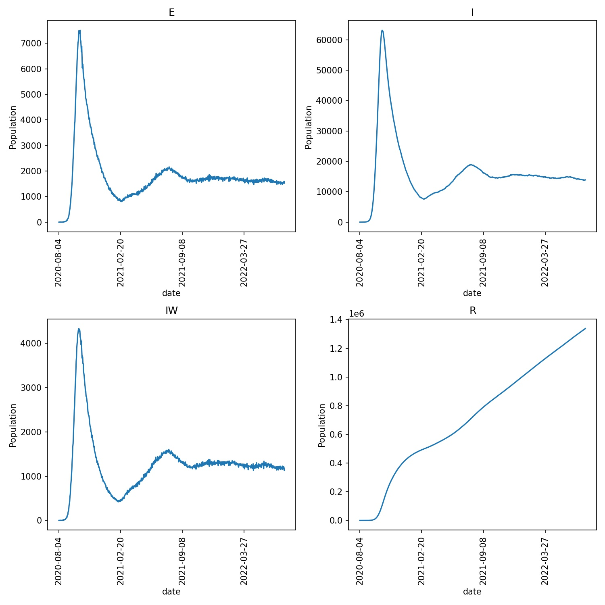

===============
Local lockdowns
===============

In the :doc:`last chapter <07_cutoff>` it was implied that the parameters
for equation 1, and the action of the ``cutoff`` parameter, were global,
and applied to all wards equally. If this was true, then it would make
it difficult for ``metawards`` to model ward-specific behaviour, such
as local lockdowns, or differences in local behaviour.
In reality, ``metawards`` provides support for ward-specific values of
the scaling and cutoff parameters.

Limiting movement at a local level
----------------------------------

Every ward can have its own value
of the cutoff parameter. Movement between two wards is only permitted
if the distance between wards is less than the minimum of the
cutoff distance of each ward, and the value of
:meth:`Parameters.dyn_dist_cutoff <metawards.Parameters.dyn_dist_cutoff>`,
e.g. if this condition is true;

3. :math:`D_\text{ij} < \text{min}( C_i, C_j, C_\text{global} )`

where;

* :math:`D_\text{ij}` is the distance between the centres of wards
  :math:`i` and :math:`j`,
* :math:`C_i` is the local cutoff parameter for ward :math:`i`,
* :math:`C_j` is the local cutoff parameter for ward :math:`j`, and
* :math:`C_\text{global}` is the global cutoff distance set via
  :meth:`Parameters.dyn_dist_cutoff <metawards.Parameters.dyn_dist_cutoff>`

Scaling FOI at a local level
----------------------------

Every ward can have its own value of the FOI scaling parameter. In reality,
equation 1 is actually;

4. :math:`F(w) = S \times S_l(w) \times U(t) \times \sum_s [ C_s \beta_s N_s(w) ]`

where;

* :math:`S_l(w)` is the local scaling factor for ward :math:`w`. This acts
  together with :math:`S`, :math:`U(t)` and :math:`C_s` to give you a lot
  of control over how infectious individuals at each disease stage in each
  ward contribute to the ward's FOI.

Reading and writing local parameters
------------------------------------

You can read and write local ward parameters from within a custom
iterator. The local ward parameters are stored in the
:class:`network.nodes <metawards.Nodes>` object. This provides arrays
which are indexed by ward ID (i.e. counting up from ``1`` to ``nnodes + 1``).

:meth:`network.nodes.scale_uv <metawards.Nodes.scale_uv>` contains the
:math:`S_l(w)` values for each node, while
:meth:`network.nodes.cutoff <metawards.Nodes.cutoff>` contains the
cutoff values for each node (in kilometers).

The scaling factors for each node default to ``1.0`` (meaning no local scaling),
while the cutoff defaults to a large distance that is greater than the
distance between any two points on Earth (meaning thus no local cutoff).

As these values are used as part of the FOI calculation, they must be
read and set during the ``foi`` stage of the model day. For example,
create a new iterator called ``lockdown.py`` and copy in the below;

.. code-block:: python

    from metawards.iterators import iterate_default

    def advance_lockdown(network, **kwargs):
        scale_uv = network.nodes.scale_uv
        cutoff = network.nodes.cutoff

        # set a lockdown in even-numbered wards
        for i in range(2, network.nnodes, 2):
            scale_uv[i] = 0.0
            cutoff[i] = 0.0

    def iterate_lockdown(stage, **kwargs):
        # get the default functions for this stage
        funcs = iterate_default(stage, **kwargs)

        if stage == "foi":
            # make sure that advance_lockdown is called
            # first in the foi stage
            return [advance_lockdown] + funcs
        else:
            return funcs

This iterator defines the ``advance_lockdown`` advance function. This
simply loops over all even-numbered wards and sets
:meth:`network.nodes.scale_uv <metawards.Nodes.scale_uv>` and
:meth:`network.nodes.cutoff <metawards.Nodes.cutoff>` to zero.
In effect, this places half of the country into extreme lockdown,
where the disease is unable to spread.

The ``iterate_lockdown`` function takes the ``stage`` parameter. This
tells ``metawards`` that this iterator wants to specify the advance
functions to call at different stages. By default, this returns the
default advance functions for that stage (as returned by
:func:`~metawards.iterators.iterate_default`). For the ``foi`` stage,
this return ``advance_lockdown`` before the default functions, thereby
ensuring that ``advance_lockdown`` changes the
:meth:`network.nodes.scale_uv <metawards.Nodes.scale_uv>` and
:meth:`network.nodes.cutoff <metawards.Nodes.cutoff>` ward-local parameters
before they are used to calculate the force of infection of each ward.

You can run this iterator using;

.. code-block:: bash

   metawards -d lurgy3 -a ExtraSeedsLondon.dat --iterator lockdown

You should see that the infection spreads to only half of the country,
as the lurgy can only infect the half of the population that are
resident of visiting wards that are not in complete lockdown. For example,
I see;

::

    ...

    ─────────────────────────────────────────────── Day 67 ───────────────────────────────────────────────
    S: 45526353  E: 871045  I: 5537877  R: 4146802  IW: 4293  POPULATION: 56082077
    Number of infections: 6408922

    ─────────────────────────────────────────────── Day 68 ───────────────────────────────────────────────
    S: 44593470  E: 901872  I: 5911611  R: 4675124  IW: 4294  POPULATION: 56082077
    Number of infections: 6813483

    ─────────────────────────────────────────────── Day 69 ───────────────────────────────────────────────
    S: 43632470  E: 932883  I: 6269338  R: 5247386  IW: 4294  POPULATION: 56082077
    Number of infections: 7202221

    ...

    ────────────────────────────────────────────── Day 184 ───────────────────────────────────────────────
    S: 28691853  E: 0  I: 2  R: 27390222  IW: 0  POPULATION: 56082077
    Number of infections: 2

    ────────────────────────────────────────────── Day 185 ───────────────────────────────────────────────
    S: 28691853  E: 0  I: 2  R: 27390222  IW: 0  POPULATION: 56082077
    Number of infections: 2

    ────────────────────────────────────────────── Day 186 ───────────────────────────────────────────────
    S: 28691853  E: 0  I: 0  R: 27390224  IW: 0  POPULATION: 56082077
    Number of infections: 0
    Ending on day 186

Custom ward-local parameters
----------------------------

You can also read and write your own custom ward-local parameters.
You do this by calling
:meth:`network.nodes.get_custom <metawards.Nodes.get_custom>`. For example;

.. code-block:: python

   my_params = network.nodes.get_custom("my_params", default=0.0)

will return the custom ward-local parameters called ``my_params``. If these
don't exist, then they are created, with each ward given a default
starting value specified by ``default`` (here ``0.0``). The return value
is the array indexed by ward ID. This can be read and written in an identical
way to :meth:`network.nodes.scale_uv <metawards.Nodes.scale_uv>` and
:meth:`network.nodes.cutoff <metawards.Nodes.cutoff>`.

.. note::

   Custom ward-level parameters are always stored as an array of
   floating point numbers.

You can use custom parameters to store or manipulate extra ward-level data.
For example, edit your ``lockdown.py`` iterator to read;

.. code-block:: python

    from metawards.iterators import iterate_default
    from metawards.utils import Console

    def advance_lockdown(network, workspace, **kwargs):
        # get the ward-specific scaling and cutoff parameters
        scale_uv = network.nodes.scale_uv
        cutoff = network.nodes.cutoff

        # get the custom parameter 'in_lockdown' which we will
        # initialise to 0 (meaning false)
        in_lockdown = network.nodes.get_custom("in_lockdown", default=0)

        # count of number of case-free days per ward
        case_free_days = network.nodes.get_custom("case_free_days", default=0)

        # get the total number of infections from the workspace
        I_in_wards = workspace.I_in_wards

        # loop over all wards
        for i in range(1, network.nnodes + 1):
            # is this ward in lockdown?
            if in_lockdown[i]:
                # has the number of infections dropped to zero? If so,
                # then leave lockdown
                if I_in_wards[i] == 0:
                    # we need 28 case-free days before releasing lockdown
                    if case_free_days[i] > 28:
                        Console.debug(f"Ward {i} leaving lockdown")
                        # stay on high vigilence, so keep actions that
                        # reduce beta to 20% of normal
                        scale_uv[i] = 0.2
                        cutoff[i] = 99999.99
                        in_lockdown[i] = 0
                        case_free_days[i] = 0
                    else:
                        case_free_days[i] += 1
                        Console.debug(f"Ward {i} case_free_days equals {case_free_days[i]}")
                else:
                    case_free_days[i] = 0

            # if not, then enter lockdown if the number of infections
            # goes above 5
            elif I_in_wards[i] > 5:
                Console.debug(f"Ward {i} entering lockdown")
                in_lockdown[i] = 1
                case_free_days[i] = 0

                # stop all travel and enact measures that
                # will scale down beta to 1% of normal
                cutoff[i] = 0.0
                scale_uv[i] = 0.01

        # get the number of wards in lockdown
        num_lockdown = int(sum(in_lockdown))

        if num_lockdown > 0:
            Console.print(f"Number of wards in lockdown equals {num_lockdown}")

    def iterate_lockdown(stage, **kwargs):
        # get the default functions for this stage
        funcs = iterate_default(stage=stage, **kwargs)

        if stage == "foi":
            return [advance_lockdown] + funcs
        else:
            return funcs

In this case ``advance_lockdown`` will move individual wards in and out
of local lockdowns depending on the number of infections in that ward
(read from the :meth:`workspace.I_in_wards <metawards.Workspace.I_in_wards>`
array from the passed :class:`~metawards.Workspace` object).

Two ward-local custom parameters are used to record whether or not
a ward is in a local lockdown;

* ``in_lockdown`` is 1 if the ward is in lockdown, and 0 if it is not
* ``case_free_days`` is the count of the number of consecutive days in
  a ward without an infection (really detectable infection, e.g. an
  individual in the ``I`` state).

The ``advance_lockdown`` function works by looping over all wards and
seeing if the ward is in lockdown by checking the ``in_lockdown`` value
for that ward. If it is, and if the number of infections is zero, then
it checks if more than 28 case-free days have passed. If they have, then
the local lockdown is relaxed, travel is allowed (cutoff is set to
a large value) and the scaling factor is increased to ``0.2`` (implying
that measures such as mask wearing, physical distancing etc. are still
followed).

If 28 days have not passed, then the number of case-free days is incremented.

If the ward is not in local lockdown, then if the number of local detected
infections goes above 5 then a local lockdown is initiated. Travel is
halted (cutoff is set to 0) and stringent measures are taken such that
the scaling factor is ``0.01`` (implying that ``beta`` is scaled down by 99%).

Finally, the number of wards in lockdown is calculated as the sum of
the ``in_lockdown`` custom parameter, and is printed to the screen.

.. note::

   Note that there are some additional :meth:`Console.debug <metawards.utils.Console.debug>`
   statements in the function that print out debug lines when wards move
   in and out of lockdown.

You can run this iterator using;

.. code-block:: bash

   metawards -d lurgy3 -a ExtraSeedsLondon.dat --iterator lockdown

You should see that the number of wards in lockdown increases as the
disease spreads. The spread is slowed down, but as wards come out of
lockdown they are sometimes re-infected, and have to re-lockdown. You
may see wave like behaviour as the disease is slowly brought under
control. For example, for me, the plot of the outbreak, produced via;

.. code-block:: bash

   metawards-plot -i output/results.csv.bz2

shows the following ``output/overview.jpg`` plot;

This wave behaviour is more clear if we make the entering of exiting of
local lockdown more extreme. For example, update your ``lockdown.py``
to read;

.. code-block:: python

    from metawards.iterators import iterate_default
    from metawards.utils import Console

    def advance_lockdown(network, workspace, **kwargs):
        # get the ward-specific scaling and cutoff parameters
        scale_uv = network.nodes.scale_uv
        cutoff = network.nodes.cutoff

        # get the custom parameter 'in_lockdown' which we will
        # initialise to 0 (meaning false)
        in_lockdown = network.nodes.get_custom("in_lockdown", default=0)

        # count of number of case-free days per ward
        case_free_days = network.nodes.get_custom("case_free_days", default=0)

        # get the total number of infections from the workspace
        I_in_wards = workspace.I_in_wards

        # loop over all wards
        for i in range(1, network.nnodes + 1):
            # is this ward in lockdown?
            if in_lockdown[i]:
                # has the number of infections dropped to zero? If so,
                # then leave lockdown
                if I_in_wards[i] == 0:
                    # we need 28 case-free days before releasing lockdown
                    if case_free_days[i] > 28:
                        Console.debug(f"Ward {i} leaving lockdown")
                        # completely relax the lockdown
                        scale_uv[i] = 1.0
                        cutoff[i] = 99999.99
                        in_lockdown[i] = 0
                        case_free_days[i] = 0
                    else:
                        case_free_days[i] += 1
                        Console.debug(f"Ward {i} case_free_days equals {case_free_days[i]}")
                else:
                    case_free_days[i] = 0

            # if not, then enter lockdown if the number of infections
            # goes above 5
            elif I_in_wards[i] > 5:
                Console.debug(f"Ward {i} entering lockdown")
                in_lockdown[i] = 1
                case_free_days[i] = 0

                # stop all travel and enact measures that
                # stop all local transmission (beta is 0)
                cutoff[i] = 0.0
                scale_uv[i] = 0.0

        # get the number of wards in lockdown
        num_lockdown = int(sum(in_lockdown))

        if num_lockdown > 0:
            Console.print(f"Number of wards in lockdown equals {num_lockdown}")

    def iterate_lockdown(stage, **kwargs):
        # get the default functions for this stage
        funcs = iterate_default(stage=stage, **kwargs)

        if stage == "foi":
            return [advance_lockdown] + funcs
        else:
            return funcs

The only change is that ``scale_uv[i]`` is set to ``0.0`` for wards that
are in lockdown (i.e. there is no more spread), while ``scale_uv[i]``
is returned to ``1.0`` for wards that leave lockdown. This extreme switching
when entering and leaving lockdown causes waves of infection that
spread across wards, e.g. when I run this model I see;

.. image:: ../../images/tutorial_3_8_2.jpg
   :alt: Outbreak with local lockdowns resulting in waves of disease
