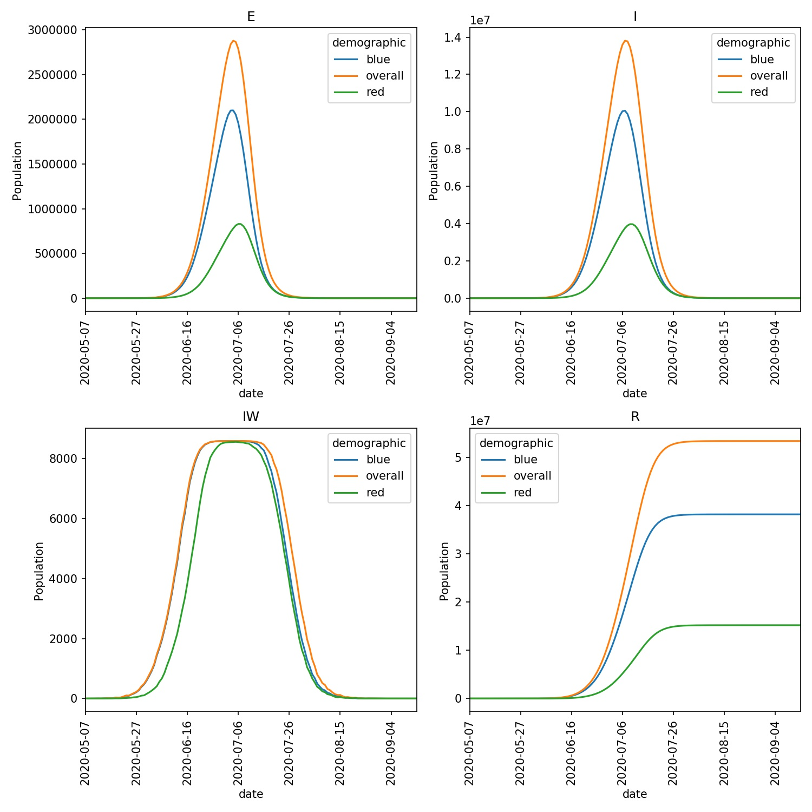

==========================
Mixers and Merge-functions
==========================

In the last page you modelled outbreaks that were seeded either in
the *red* population, who were all *players*, and the *blue* population,
which contained both *players* and all of the *workers*.

This resulted in two different outbreaks, which was understandable given
that only *workers* move between wards. One issue was that the demographics
were completely separate - infected individuals in the *red* population
couldn't infect individuals in the *blue* population and vice-versa.

This is because the :class:`~metawards.Network` for each demographic was
advanced independently, and no mixing took place.

Force of infection (FOI)
------------------------

Infected individuals in a ward contribute to the *force of infection* (FOI)
of that ward. The higher the FOI, the more likely it is that other
individuals in a ward will become infected.

The FOIs for each demographic sub-network are calculated independently,
based only on the infected individuals from that demographic. We can thus
use the FOI calculation as a way of enabling different demographics to
mix. We do this in ``metawards`` using custom functions, called
:doc:`../../api/index_MetaWards_mixers`. These choose different
``merge functions`` that are
used to mix and merge calculations of FOIs across different demographics.

The default mixer is :func:`~metawards.mixers.mix_none`, which, as the
name suggests, performs no mixing between demographics.

Mix evenly
----------

An alternative is to use :func:`~metawards.mixers.mix_evenly`. This evenly
mixes all demographics. It sets the FOI in each ward in each demographic
equal to the sum of the FOIs in that ward across all demographics.

You can choose this mixer using the ``--mixer`` argument. Run ``metawards``
using;

.. code-block:: bash

  metawards -d lurgy3 -D demographics.json -a ExtraSeedsLondon.dat --mixer mix_evenly

You should now see that the outbreak spreads from the initial infection in
the *red* demographic to the *blue workers*, who then spread it around
the country to both the *red* and *blue* groups.

The trajectories for each of the demographics are written into a single
csv file called ``output/trajectory.csv.bz2``. This can be loaded
into tools such as Excel, R or Pandas for detailed analysis. For example,
in Pandas you can load the file using;

.. code-block:: python

   >>> import pandas as pd
   >>> df = pd.read_csv("output/trajectory.csv.bz2")
   >>> print(df)
         day        date demographic         S  E  I         R  IW
    0      0  2020-05-07     overall  56082077  0  0         0   0
    1      0  2020-05-07         red  16806501  0  0         0   0
    2      0  2020-05-07        blue  39275576  0  0         0   0
    3      1  2020-05-08     overall  56082077  0  0         0   0
    4      0  2020-05-08         red  16806501  0  0         0   0
    ..   ...         ...         ...       ... .. ..       ...  ..
    388    0  2020-09-13         red   1609032  0  0  15197469   0
    389    0  2020-09-13        blue   1101473  0  1  38174102   0
    390  130  2020-09-14     overall   2710505  0  0  53371572   0
    391    0  2020-09-14         red   1609032  0  0  15197469   0
    392    0  2020-09-14        blue   1101473  0  0  38174103   0

    [393 rows x 8 columns]

You can see that the values for each day for each demographic are printed
in turn. The column called ``demographic`` holds the name of the demographic,
with the overall total network called ``overall``.

You can plot this data easily using ``metawards-plot``, e.g.

.. code-block:: bash

   metawards-plot -i output/trajectory.csv.bz2

This will produce a graph called ``output/demographics.jpg``.
This should look similar to this;

Notice how infections in the *red* demographic lag behind those of the
*blue* demographic. This makes sense, as it is only the workers from the
*blue* demographic that can be infected outside their home ward. The
*blue workers* are thus the source of the infection for the *red* demographic.
