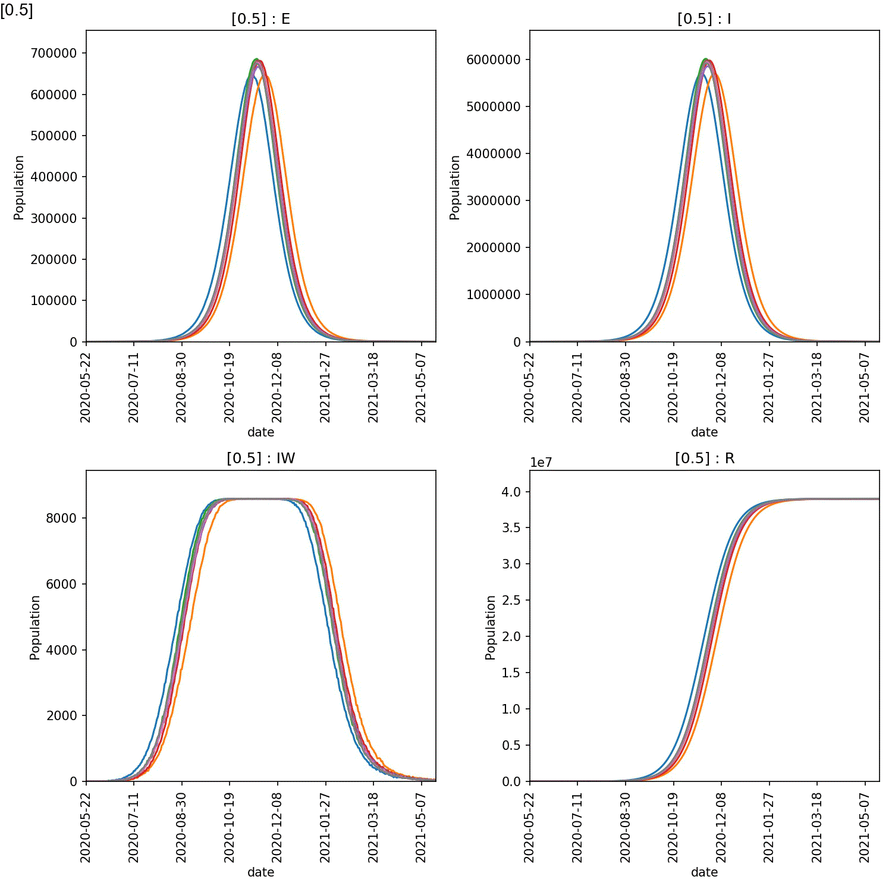

======================
Conditional Compliance
======================

In the last section we saw that self-isolation will only work if
individuals self-isolate at an early stage of the lurgy, and for 5-7 days.

However, that model and conclusion is flawed. The model assumed that
everyone who had reached the self-isolation stage would elect to
self-isolate, and would remain their for the full required duration.

Unfortunately, this is not realistic. Many individuals would not
self-isolate, e.g. because they don't feel that ill, don't recognise
the symptoms, have financial or social pressures to keep going out
etc. Equally, many may break quarantine early, if they feel better or
more mobile.

To model this, we need to conditionally send only a percentage of
individuals into self-isolation. And then, for each day quarantine,
we need to release an increasing percentage back to their normal
behaviour.

Moving a fraction of individuals
--------------------------------

Both the :meth:`~metawards.movers.go_isolate` and
:meth:`~metawards.movers.go_to` go functions accept the ``fraction``
keyword argument. This argument sets the percentage (or fraction)
of the population who should move. By default this is ``1.0`` (representing
100%). This fraction is used to sample a random number of individuals
according to a binomial distribution.

We can adjust this value to examine impact of reduced self-isolation
compliance on the outbreak.

To do this, update your ``move_isolate.py`` move function to;

.. code-block:: python

    from metawards import Population
    from metawards import Networks
    from metawards.movers import go_isolate, go_to

    def move_isolate(network: Networks, population: Population, **kwargs):
        ndays = 7
        isolate_stage = 3
        compliance_fraction = 0.5

        day = population.day % ndays
        isolate = f"isolate_{day}"

        go_isolate_day = lambda **kwargs: go_isolate(
                                            go_from="home",
                                            go_to=isolate,
                                            self_isolate_stage=isolate_stage,
                                            fraction=compliance_fraction,
                                            **kwargs)

        go_released = lambda **kwargs: go_to(go_from=isolate,
                                            go_to="released",
                                            **kwargs)

        return [go_released, go_isolate_day]

Here we have added ``compliance_fraction``, set to ``0.5`` to represent,
on average, to 50% of individuals complying with the need to go into
self-isolation. This fraction is passed as ``fraction`` to the
``go_isolate`` function.

Run ``metawards`` using;

.. code-block:: bash

   metawards -d lurgy4 -D demographics.json -a ExtraSeedsLondon.dat --mixer mix_isolate --mover move_isolate --nsteps 365

You should see that infection spreads quickly, as the 50% of individuals who
each day decide not to self-isolate from stage 2 of the lurgy infect the
susceptible population. The outbreak should end with approximately
two thirds of those infected recovering in ``released`` (and so had
isolated), and one third recovering in ``home`` (having never isolated).
A plot of the the demographics shows this more clearly;

.. code-block:: bash

   metawards-plot -i output/trajectory.csv.bz2

.. image:: ../../images/tutorial_6_4_1.jpg
   :alt: Demographics for 50% self-isolation compliance

Scanning compliance
-------------------

We can investigate the effect of different levels of compliance by
scanning through ``compliance_fraction``. Update your ``move_isolate.py``
to read;

.. code-block:: python

    from metawards import Population
    from metawards import Networks
    from metawards.movers import go_isolate, go_to

    def move_isolate(network: Networks, population: Population, **kwargs):
        user_params = network.params.user_params

        ndays = 7
        isolate_stage = 3
        compliance_fraction = user_params["compliance"]

        day = population.day % 7
        isolate = f"isolate_{day}"

        go_isolate_day = lambda **kwargs: go_isolate(
                                            go_from="home",
                                            go_to=isolate,
                                            self_isolate_stage=isolate_stage,
                                            fraction=compliance_fraction,
                                            **kwargs)

        go_released = lambda **kwargs: go_to(go_from=isolate,
                                            go_to="released",
                                            **kwargs)

        return [go_released, go_isolate_day]

The only change here is that we now set ``compliance_fraction`` from the
``compliance`` user defined parameter.

Now create a scan file called ``scan_compliance.dat`` that contains;

::

    .compliance
        1.00
        0.95
        0.90
        0.85
        0.80
        0.75
        0.70
        0.65
        0.60
        0.55
        0.50

This scans ``compliance`` from ``1.00`` to ``0.50`` in increments of ``0.05``.

This is the command to run a single scan locally;

.. code-block:: bash

   metawards -d lurgy4 -D demographics.json -a ExtraSeedsLondon.dat --mixer mix_isolate --mover move_isolate --extractor extract_none --nsteps 365 -i scan_compliance.dat

You will likely need a cluster to perform repeats, so here is a suitable
PBS and slurm job file;

::

    #!/bin/bash
    #PBS -l walltime=12:00:00
    #PBS -l select=4:ncpus=64:mem=64GB
    # The above sets 4 nodes with 64 cores each

    source $HOME/envs/metawards/bin/activate

    # change into the directory from which this job was submitted
    cd $PBS_O_WORKDIR

    metawards -d lurgy4 -D demographics.json -a ExtraSeedsLondon.dat \
            --mixer mix_isolate --mover move_isolate --extractor extract_none \
            --nsteps 365 -i scan_compliance.dat --repeats 8 \
            --nthreads 16 --force-overwrite-output --no-spinner --theme simple

::

    #!/bin/bash
    #SBATCH --time=01:00:00
    #SBATCH --ntasks=4
    #SBATCH --cpus-per-task=64
    # The above sets 4 nodes with 64 cores each

    source $HOME/envs/metawards/bin/activate

    metawards -d lurgy4 -D demographics.json -a ExtraSeedsLondon.dat \
            --mixer mix_isolate --mover move_isolate --extractor extract_none \
            --nsteps 365 -i scan_compliance.dat --repeats 8 \
            --nthreads 16 --force-overwrite-output --no-spinner --theme simple

You can generate an overview animation using;

.. code-block:: bash

   metawards-plot -i output/results.csv.bz2
   metawards-plot --animate output/overview*

The resulting animation should look like this;

         of compliance with self-isolation

From this it is clear the high compliance with self-isolation is needed
to prevent a large-scale outbreak. You can see exactly the effect
by plotting the average number of recovereds as a function of the level
of compliance at the end of the year (365 days). This can be done
in Python pandas, R or Excel. For example, here is how you would make
this plot in pandas;

.. code-block:: python

   >>> import pandas as pd
   >>> import matplotlib as mpl
   >>> df = pd.read_csv("output/results.csv.bz2")
   >>> day_365 = df[df["day"] == 365]
   >>> day_365_mean = day_365.groupby("fingerprint").mean()
   >>> ax = day_365_mean.plot.line(x=".compliance", y="R")
   >>> ax.yaxis.set_major_formatter(mpl.ticker.StrMethodFormatter('{x:,.0f}'))
   >>> fig = ax.get_figure()
   >>> fig.tight_layout()
   >>> fig.savefig("compliance.jpg")

The figure I get is shown here;

.. image:: ../../images/tutorial_6_4_3.jpg
   :alt: Effect of compliance on the number of infections (recovereds)

For the lurgy, compliance of 90% still leads to ~6 million infections over
the year, while compliance of 80% leads to ~20 million. If compliance drops
to 50%, then ~39 million individuals are infected.
