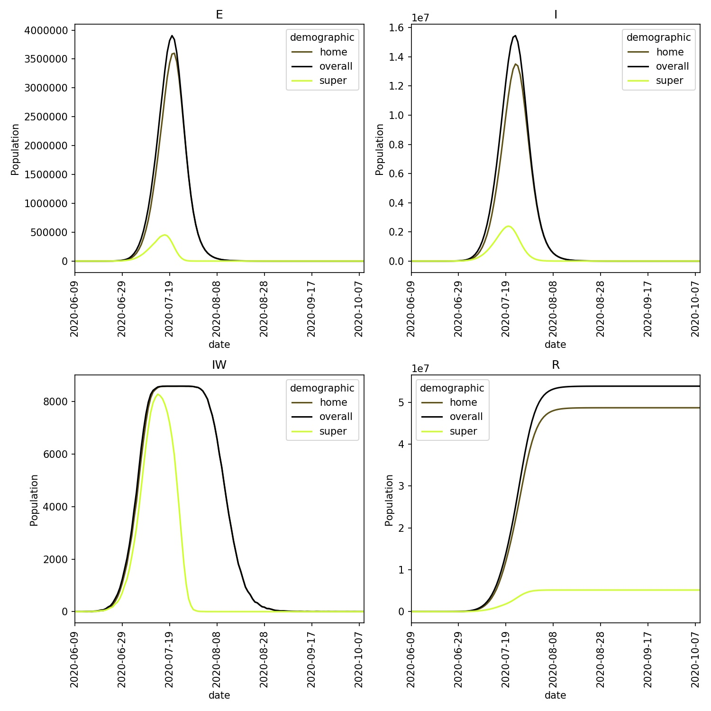

===========================
Disease pathways and stages
===========================

Up to this point, every individual modelled in ``metawards`` progresses
through the same stages of the same disease pathway. This pathway
is defined in the disease file (e.g. ``lurgy4.json``) and progresses
an individual from being susceptible to infection (``S``) to the
final stage of the disease (normally called ``R`` to represent individuals
who are removed from the outbreak).

Stages of the lurgy
-------------------

For the lurgy, the disease stages are;

* ``S`` - this is the starting point of all individuals

* ``Stage 0`` - this is a holding state. Individuals are moved into this
  state as soon as they are infected. This is used to record internally
  in ``metawards`` to record new infections each day. The ``progress``
  value for this state (``progress[0]``) should be ``1.0``, to show
  that individuals will immediately progress to ``Stage 1`` (the latent, ``E``
  state) the next day. Equally, the ``beta`` value for this state
  (``beta[0]``) should be ``0.0`` as individuals in this state should
  not contribute to the force of infection.

* ``Stage 1`` - this is the latent or ``E`` state. Individuals are held
  in this state with a duration defined by ``progress[1]``. The ``beta[1]``
  value should be ``0.0`` as latent individuals are not infectious and
  should not thus contribute to the force of infection.

* ``Stages 2-4`` - these are the infected or ``I`` states. The lurgy has
  three such states, with ``Stage 2`` (or ``I1``) representing the
  asymptomatic infectious state (low ``beta`` but zero ``too_ill_to_move``),
  then ``Stage 3`` (or ``I2``) representing the initial symptomatic
  state (medium ``beta`` and medium ``too_ill_to_move``), and ``Stage 4``
  (or ``I3``) representing the highly symptomatic state (medium ``beta``
  and high ``too_ill_to_move``).

* ``Stage 5`` - this is the removed or ``R`` state. Individuals in this
  state cannot infect others, and so ``beta`` is ``0.0`` and ``too_ill_to_move``
  is ``1.0`` (no need to model movements of non-infectious or infectable
  individuals). The ``progress`` value is ``0.0`` as, once removed,
  individuals remain in this stage for the remainder of the *model run*.

Modelling a fraction of asymptomatic super-spreaders
----------------------------------------------------

It is really useful to have the ability to model different demographics
following different disease pathways. For example, up to now we have
modelled the lurgy as having an asymptomatic infectious phase which
everyone will move through. However, in reality, only a small proportion
of those infected by the lurgy will become these asymptomatic
"super-spreaders". We would like to investigate how the percentage
of these super-spreaders, and their mobility and infectivity affects the
progression of the outbreak. To do this, we will create two demographics;

1. **home**, which will contain a population who do not progress through
   the asymptomatic infectious stage, and

2. **super**, which will contain a population of super-spreaders who do
   move through the asymptomatic infectious phase.

To start, we need to create disease files for the **home** and **super**
demographics. Do this by creating two files, first ``lurgy_home.json`` that
should contain;

::

  { "name"             : "The Lurgy",
    "version"          : "June 2nd 2020",
    "author(s)"        : "Christopher Woods",
    "contact(s)"       : "christopher.woods@bristol.ac.uk",
    "reference(s)"     : "Completely ficticious disease - no references",
    "beta"             : [0.0, 0.0, 0.5, 0.5, 0.0],
    "progress"         : [1.0, 1.0, 0.5, 0.5, 0.0],
    "too_ill_to_move"  : [0.0, 0.0, 0.5, 0.8, 1.0],
    "contrib_foi"      : [1.0, 1.0, 1.0, 1.0, 0.0]
  }

and ``lurgy_super.json`` that should contain;

::

  { "name"             : "The Lurgy",
    "version"          : "June 2nd 2020",
    "author(s)"        : "Christopher Woods",
    "contact(s)"       : "christopher.woods@bristol.ac.uk",
    "reference(s)"     : "Completely ficticious disease - no references",
    "beta"             : [0.0, 0.0, 0.8, 0.2, 0.1, 0.0],
    "progress"         : [1.0, 1.0, 0.5, 0.5, 0.5, 0.0],
    "too_ill_to_move"  : [0.0, 0.0, 0.0, 0.1, 0.0, 1.0],
    "contrib_foi"      : [1.0, 1.0, 1.0, 1.0, 1.0, 0.0]
  }

In these files we have removed the asymptomatic infectious phase from the
``home`` demographic, and then changed the ``super`` demographic to
experience a highly infectious asymptomatic stage, followed by a
very mild disease of decreasing infectiousness.

Next, we need to create the ``demographics.json`` file that should contain;

::

    {
        "demographics" : ["home", "super"],
        "work_ratios"  : [ 0.9, 0.1 ],
        "play_ratios"  : [ 0.9, 0.1 ],
        "diseases"     : [ null, "lurgy_super" ]
    }

This describes the two demographics, with 90% of individuals in the
``home`` demographic, and 10% in the ``super`` demographic. The new
line here, ``disease_stages``, specifies the file for the disease stages
for each demographic, e.g. ``home`` will follow the default disease, while
``super`` will follow ``lurgy_super``.

.. note::

   ``null`` in a json file means "nothing". In this case, "nothing" means
   that the ``home`` demographic should use the disease parameters from
   the global disease file set by the user.

Run ``metawards`` using the command;

.. code-block:: bash

  metawards -d lurgy_home -D demographics.json --mixer mix_evenly -a ExtraSeedsLondon.dat

.. note::

   Here we set the global disease file, via ``-d lurgy_home`` to ``lurgy_home``.
   This will be used by the ``home`` demographic. In theory we could have
   specified ``lurgy_home`` directly in the ``demographics.json`` file,
   but this would mean we would have to specify it twice, once there and once
   globally. It is better to define things once only, as this leads to fewer
   bugs.

You should see that the disease spreads quickly via the super-spreaders, with
all, or almost all becoming infected. You can see this in the demographics
plot, produced via;

.. code-block:: bash

    metawards-plot -i output/trajectory.csv.bz2

You should see something similar to this, which shows that the infection
burns quickly through the super-spreader demographic, moving through that
entire demographic in just a couple of months.

.. note::

   It is counter-intuitive that the super-spreaders are all infected quickly,
   and complete the outbreak long before the general population. This is
   due to the model setup. The super-spreaders all interact with each other
   within their demographic, and so, as their ``beta`` value is high,
   there is a high probability that they will infect each other quickly.
   Their limited population naturally means that it takes less time until
   all members of the this population are infected.

   While not wholly realistic, this does make some practical sense,
   as real super-spreaders will
   go about their normal day during an outbreak as they do not noticeably
   become ill. As they will continue normally, it could make sense that
   they outbreak could burn through that population quickly,
   until the point where there are few remaining. Meanwhile, the larger,
   more general population experiences a slower outbreak.

   One way to counter this effect would be to use an interaction matrix
   to slow down the rate of infection in the super-spreader demographic.
   This would reflect the reality that super-spreaders are more dispersed,
   and so less likely to interact with one another than with members
   of the general population. An interaction matrix of, e.g.
   (1, 1, 1, 0.5) may thus be appropriate, although data fitting would
   be needed to find the exact values.
