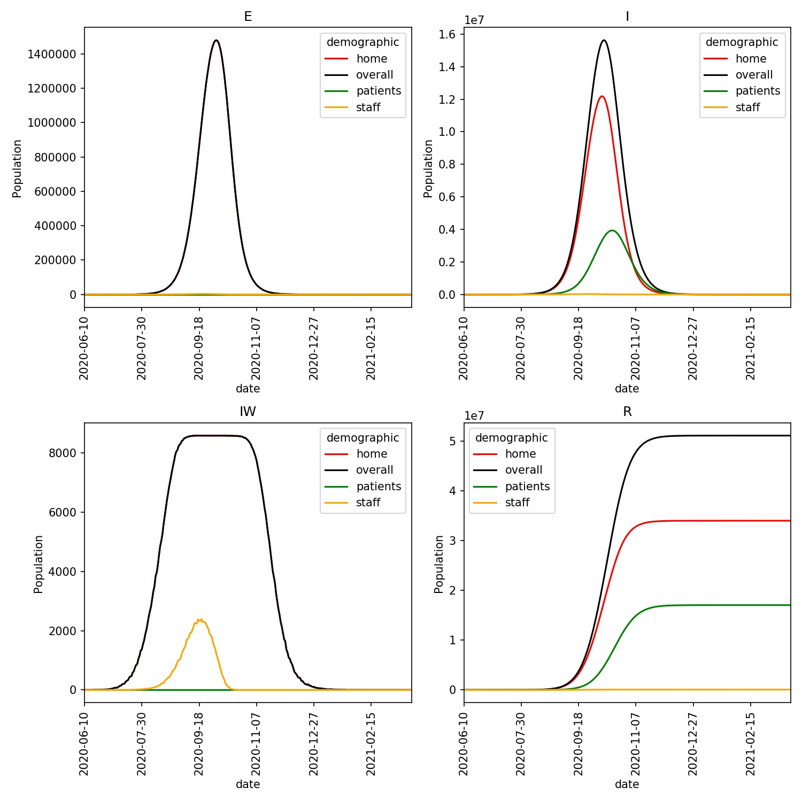

====================
Conditional Pathways
====================

In the last example we saw how each demographic can be given a different
disease pathway. In this section, we will see how to use move functions
to move individuals between pathways. We did this before
:doc:`when we modelled quarantine. <../part06/05_quarantine>`
Now, we will see how, by using different disease stages, we can create
a range of different pathways through which different individuals
can conditionally progress.

Modelling a hospital
--------------------

In this example we will create a model of a hospital. The demographics
involved will be;

* ``patients`` : Patients at the hospital who are infected with the lurgy
* ``staff`` : Hospital staff who care for the patients
* ``home`` : The general population who are neither patients or staff

Members of the ``staff`` and ``home`` demographics will move along the
stages of the lurgy according to ``lurgy4.json``. Hospital ``patients``
will move through two hospital states, which we will refer to as
``H1`` and ``H2``. These are defined in the file ``lurgy_hospital.json``,
which you should create and copy in the below;

::

  { "name"             : "The Lurgy (hospital patients)",
    "version"          : "June 10th 2020",
    "author(s)"        : "Christopher Woods",
    "contact(s)"       : "christopher.woods@bristol.ac.uk",
    "reference(s)"     : "Completely ficticious disease - no references",
    "beta"             : [0.0, 0.0, 0.2, 0.2, 0.0],
    "progress"         : [1.0, 1.0, 0.2, 0.2, 0.0],
    "too_ill_to_move"  : [0.0, 0.0, 1.0, 1.0, 1.0],
    "contrib_foi"      : [0.0, 0.0, 1.0, 1.0, 0.0]
  }

.. note::

   Every disease must include the ``*`` and ``E`` stages, which are
   stages 0 and 1, and the ``R`` stage which is the last stage. This
   means that ``H1`` and ``H2`` are stages 2 and 3 in this file, both
   of which have ``beta == 0.2``, ``progress == 0.2`` and
   ``too_ill_to_move == 1.0``. While the ``H1`` and ``H2`` stages
   are identical now, we will look to change them later in this
   tutorial.

The aim of the model will be that 20% of those suffering in the ``I2``
stage of ``lurgy4.json`` will be moved to the ``H1`` stage of
``lurgy_hospital.json``, and will then progress to ``H2`` and then
``R`` in the hospital.

We will next set that 1% of the worker population are hospital staff, while,
initially, nobody has the lurgy, and so there are no hospital patients.
We can set this using the file ``demographics.json``, which you should
create and copy in the below;

::

    {
        "demographics" : ["home", "staff", "patients"],
        "work_ratios"  : [ 0.99,   0.01,     0.00 ],
        "play_ratios"  : [ 1.00,   0.00,     0.00 ],
        "diseases"     : [ null,   null,   "lurgy_hospital" ]
    }

Next, we need a mixing function that will model the interactions between
hospital staff, patients and the general population. We will use the
following interaction matrix;

.. list-table::
   :widths: 25 25 25 25
   :header-rows: 1
   :stub-columns: 1

   * -
     - home
     - staff
     - patients
   * - home
     - 1.0
     - 1.0
     - 0.0
   * - staff
     - 0.0
     - 0.1
     - 0.1
   * - patients
     - 0.0
     - 0.1
     - 0.0

This matrix sets that the ``home`` demographic is taking no precautions,
and are fully exposed to each other, and also fully exposed to members
of the ``staff`` demographic.

The ``staff`` demographic are taking lots of precautions, and are not
exposed to the ``home`` demographic, and only lightly exposed to other
``staff`` or members of the ``patient`` demographic (matrix values
are ``0.1``).

Finally, the ``patients`` group are isolated from one another, and so
do not infect one another. At the moment this is moot, as all patients
in this model are already infected. However, you could add a susceptible
patient population who do not have the lurgy, and then use this final
element in the matrix to control the force of infection between patients.

.. note::

   This is not an entirely realistic interaction matrix, but is set up
   to demonstrate how the only route of infection of ``staff`` is from
   ``patients``.

To use this interaction matrix, create a mixer in ``mix_hospital.py``
and copy in the below.

.. code-block:: python

    from metawards.mixers import merge_using_matrix

    def mix_shield(network, **kwargs):
        matrix = [ [1.0, 1.0, 0.0],
                   [0.0, 0.1, 0.1],
                   [0.0, 0.1, 0.0] ]

        network.demographics.interaction_matrix = matrix

        return [merge_using_matrix]

.. note::

   This is essentially an identical mixing function as that used
   in the :doc:`shielding example <../part05/03_custom>`.

.. note::

   Note that we are using :func:`~metawards.mixers.merge_using_matrix`.
   This may not be the right choice depending on how we want the
   population dynamics to mix, e.g.
   :func:`~metawards.mixers.merge_matrix_single_population` or
   :func:`~metawards.mixers.merge_matrix_multi_population` may
   be a better choice. :doc:`See here for more information <../part05/04_contacts>`.

Next, we want to make sure that we have output the populations in the
``H1`` and ``H2`` states. We can do this by creating a custom extractor
that writes the populations of all of the disease stages for just
the ``patients`` demographic to a file called ``patients.csv``. To do this,
create the file ``extract_patients.py`` and copy in the below;

.. code-block:: python

    from metawards.extractors import extract_default

    def output_patients(network, population, workspace, output_dir, **kwargs):
        # Open the file "patients.csv" in the output directory,
        # using the supplied headers for the columns
        FILE = output_dir.open("patients.csv",
                               headers=["day", "*", "E", "H1", "H2", "R"],
                               sep=",")

        # Now get the workspace for the "patients" demographic
        index = network.demographics.get_index("patients")
        subspace = workspace.subspaces[index]

        # The total population at each infection stage is the sum
        # of the work and play infections
        inf_tot = [inf + pinf for inf, pinf in
                   zip(subspace.inf_tot, subspace.pinf_tot)]

        FILE.write(str(population.day) + ",")
        FILE.write(",".join([str(x) for x in inf_tot]) + "\n")

    def extract_patients(**kwargs):
        # return all of the functions from "extract_default"
        # plus our new "output_patients"
        funcs = extract_default(**kwargs)
        funcs.append(output_patients)
        return funcs

Conditionally moving to hospital
--------------------------------

The new part of this example is that we need to add a move function that
will move 20% of individuals who are in the ``I2`` stage to
hospital, in the ``H1`` stage. We can do this by writing a move function
into the file ``move_hospital.py``, which you should create and
copy in the below;

.. code-block:: python

    from metawards.movers import go_stage

    def move_hospital(**kwargs):
        func = lambda **kwargs: go_stage(go_from=["home", "staff"],
                                         go_to="patients",
                                         from_stage=4,
                                         to_stage=2,
                                         fraction=0.2,
                                         **kwargs)

        return [func]

This move function returns :meth:`~metawards.movers.go_stage`. This is
very similar to :meth:`~metawards.movers.go_to`, except you also specify
the ``from_stage`` and ``to_stage``, which are the stage(s) to move from,
and the stage to move to. In this case, we will move 20% of individuals
from the ``I2``
stage from the ``home`` and ``staff`` demographics, which is stage 4
of ``lurgy4.json``. We will move these individuals to stage 2, which is
``H2``, in the ``patients`` demographic.

Now this is set, we can run the model using;

.. code-block:: bash

   metawards -D demographics.json -d lurgy4 --mixer mix_hospital --mover move_hospital --extract extract_hospital -a ExtraSeedsLondon.dat

You should see that the epidemic starts in the ``home`` demographic, with
no infections in ``staff`` until after a number of the more ill ``home``
individuals are moved to hospital as ``patients``. In this model, the
~70,000 staff are overwhelmed with millions of patients. This means that,
despite their care, and the lack of interaction with ``home``,
all of the members of the ``staff`` demographic become infected within
the first ~130 days of the epidemic.

You can plot this using the command;

.. code-block:: bash

   metawards-plot -i output/trajectory.csv.bz2

The resulting plot should look something like this;

You can see that the infections for the ``patients`` lag behind that of the
general population, as individuals move to hospital at a late stage in the
disease, and then remain in hospital for a long time. You can also see
in the ``IW`` plot how the ``staff`` are quickly overwhelmed and are all
infected within ~4 months.

In addition to this plot, you will also see in the output directory
the ``patients.csv.bz2`` file that was written by ``extract_patients``.
We can load this into R, pandas or Excel to find the maximum occupancy
in the hospital for the two different stages.

.. code-block:: python

   >>> import pandas as pd
   >>> df = pd.read_csv("output/patients.csv.bz2")
   >>> df["H1"].max()
   1799688
   >>> df["H2"].max()
   2166228
   >>> df[ df["H1"] == df["H1"].max() ]
        day  *  E       H1       H2        R
   126  126  0  0  1799688  2090894  6647271
   >>> df[ df["H2"] == df["H2"].max() ]
        day  *  E       H1       H2        R
   130  130  0  0  1742752  2166228  8348305

This shows that days 126-130 were particularly difficult, with nearly
4 million patients in hospital, while nearly all staff were infected.
