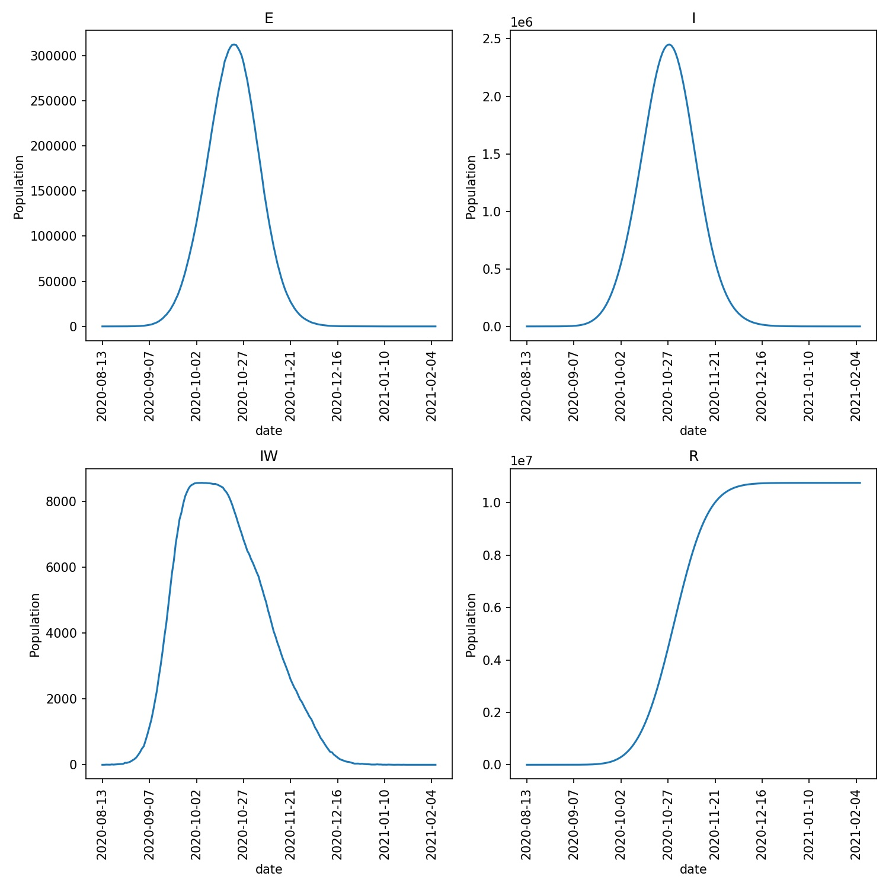

=====================
Modelling vaccination
=====================

Let's now use :class:`~metawards.movers.MoveGenerator` and
:func:`~metawards.movers.go_ward` to model vaccination.

First, we will create a new version of the lurgy that includes
a vaccination stage. To do this in Python open ipython or
jupyter and type;

.. code-block:: python

   >>> from metawards import Disease
   >>> lurgy = Disease("lurgy5")
   >>> lurgy.add("E", beta=0.0, progress=1.0)
   >>> lurgy.add("I1", beta=0.4, progress=0.2)
   >>> lurgy.add("I2", beta=0.5, progress=0.5, too_ill_to_move=0.5)
   >>> lurgy.add("I3", beta=0.5, progress=0.8, too_ill_to_move=0.8)
   >>> lurgy.add("R")
   >>> lurgy.add("V", beta=0.0, progress=0.0, is_infected=False)
   >>> lurgy.to_json("lurgy5.json", indent=2, auto_bzip=False)

or, in R/RStudio type;

.. code-block:: R

   > library(metawards)
   > lurgy <- metawards$Disease("lurgy5")
   > lurgy$add("E", beta=0.0, progress=1.0)
   > lurgy$add("I1", beta=0.4, progress=0.2)
   > lurgy$add("I2", beta=0.5, progress=0.5, too_ill_to_move=0.5)
   > lurgy$add("I3", beta=0.5, progress=0.8, too_ill_to_move=0.8)
   > lurgy$add("R")
   > lurgy$add("V", beta=0.0, progress=0.0, is_infected=FALSE)
   > lurgy$to_json("lurgy5.json", indent=2, auto_bzip=FALSE)

or, simply copy the below into the file ``lurgy5.json``;

::

    {
        "name": "lurgy5",
        "stage":           ["E", "I1", "I2", "I3", "R", "V"],
        "mapping":         ["E", "I",  "I",  "I",  "R", "V"],
        "beta":            [0.0, 0.4,  0.5,  0.5,  0.0, 0.0],
        "progress":        [1.0, 0.2,  0.5,  0.8,  0.0, 0.0],
        "too_ill_to_move": [0.0, 0.0,  0.5,  0.8,  0.0, 0.0],
        "contrib_foi":     [1.0, 1.0,  1.0,  1.0,  1.0, 1.0],
        "is_infected": [true, true, true, true, false, false],
        "start_symptom": 2
    }

This has added an extra stage, called V, which is used to hold
vaccinated individuals. Because vaccinated individuals are
not infected, we have to set ``is_infected`` to ``false`` for
this stage (note how this is set automatically for the R stage).

Also, once vaccinated, individuals will remain in the V stage. Thus
``progress`` for this stage is set to ``0.0``, just like it is
automatically set for the R stage.

We can run a quick test of this model using;

.. code-block::

   metawards -d lurgy5.json -m single -a 5

This uses the single-ward model and infects 5 individuals on day 1 with
the disease described in ``lurgy5.json``.

You should see that the outbreak progresses as before, with many of the
1000-strong population of the ward infected, and, currently, no-one
vaccinated.

Vaccinating using go_ward
-------------------------

We can model vaccination by writing a mover that uses
:class:`~metawards.movers.go_ward` to move up to 50 individuals per
day from S to V (e.g. representing a vaccination capacity of
50 vaccinations per day).

Do this by creating a file called ``move_vaccinate.py`` and copying
in the below;

.. code-block:: python

    from metawards.movers import MoveGenerator, go_ward

    def move_vaccinate(**kwargs):
        capacity = 50  # number of vaccinations per day

        def go_vaccinate(**kwargs):
            gen = MoveGenerator(from_stage="S", to_stage="V", number=capacity)
            go_ward(generator=gen, **kwargs)

        return [go_vaccinate]

Run the model using;

.. code-block:: bash

   metawards -d lurgy5.json -m single -a 5 --mover move_vaccinate.py

You should see that the number of vaccinated individuals climbs by 50 each
day. This reduces the number of susceptibles, meaning that the infection
is dampened before it can get going.

Demand-driven vaccination
-------------------------

This model started vaccination on the first day of the outbreak. We
can instead trigger vaccination based on a threshold of infections,
e.g. because maybe the vaccine has a limited supply. Edit
``move_vaccinate.py`` to add a trigger where vaccination starts
only when the number of infections grows above 100, e.g.

.. code-block:: python

    from metawards.movers import MoveGenerator, go_ward
    from metawards.utils import Console

    def move_vaccinate(**kwargs):
        capacity = 50  # number of vaccinations per day
        trigger = 100  # number of infections to trigger vaccination

        def go_vaccinate(network, population, **kwargs):
            params = network.params

            # Are we vaccinating? If this has not been set then we are not
            is_vaccinating = params.user_params.get("is_vaccinating", False)

            if not is_vaccinating and population.total >= trigger:
                # trigger vaccination
                params.user_params["is_vaccinating"] = True
                is_vaccinating = True
                Console.info("Starting vaccination")

            if is_vaccinating:
                gen = MoveGenerator(from_stage="S", to_stage="V", number=capacity)
                go_ward(generator=gen, network=network,
                        population=population, **kwargs)

        return [go_vaccinate]

Run the model using;

.. code-block:: bash

   metawards -d lurgy5.json -m single -a 5 --mover move_vaccinate.py

You should see now in the output that vaccination starts when the number
of infections rises about 100, which for me happened on day 17.
Vaccination of the remaining susceptibles completed by day 27, with
the outbreak ending with 528 vaccinated individuals and 472 who
contracted the lurgy and recovered.

National vaccination
--------------------

We can extend the model to vaccinate on a per-ward basis if the number
of infections climbs above a threshold in an individual ward. To do this,
modify ``move_vaccinate.py`` to read;

.. code-block:: python

    from metawards import WardID
    from metawards.movers import MoveGenerator, go_ward
    from metawards.utils import Console

    def move_vaccinate(**kwargs):
        capacity = 50  # number of vaccinations per day
        trigger = 20  # number of infections to trigger vaccination
        stop_trigger = 5 # number of infections to stop vaccination

        def go_vaccinate(network, workspace, **kwargs):
            # create ward-local is_vaccinating parameters, that defaults to 0.0
            is_vaccinating = network.nodes.get_custom("is_vaccinating", 0.0)

            vaccinate = []

            I_in_wards = workspace.I_in_wards

            for i in range(1, network.nnodes + 1):
                if not is_vaccinating[i]:
                    if I_in_wards[i] >= trigger:
                        is_vaccinating[i] = 1.0

                if is_vaccinating[i]:
                    if I_in_wards[i] < stop_trigger:
                        is_vaccinating[i] = 0.0
                    else:
                        vaccinate.append(WardID(i, all_commute=True))
                        vaccinate.append(WardID(i))

            nv = int(sum(is_vaccinating))

            if nv > 0:
                print(f"Vaccinating in wards: number = {nv}")
                gen = MoveGenerator(from_ward=vaccinate,
                                    from_stage="S", to_stage="V", number=capacity)
                go_ward(generator=gen, network=network,
                        workspace=workspace, **kwargs)

        return [go_vaccinate]

You can run this model using;

.. code-block:: bash

   metawards -d lurgy5.json -m 2011Data --mover move_vaccinate.py -a ExtraSeedsLondon.dat

In this case, vaccination starts in a ward if the number of infections
grows to 50 or above. Then, there is capacity for 20 vaccinations per day
per ward and per ward-link. If the number of infections in the ward drops
below 5 then vaccination is stopped.

For my run, I see that all wards enter the vaccination program, with
eventually ~44 M vaccinations and ~10 M infections. The progress
plot produced via ``metawards-plot`` is shown below;

