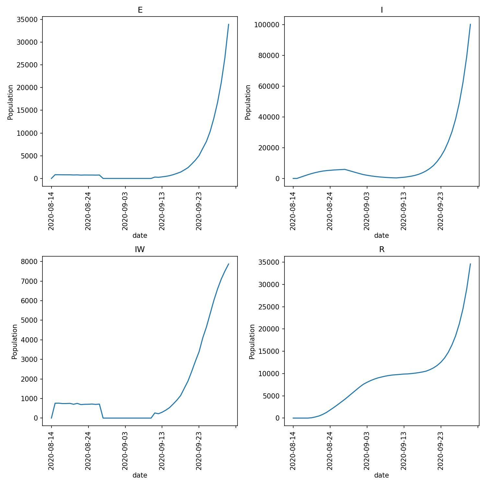

=======================
Holidays and quarantine
=======================

Another use for :func:`~metawards.movers.go_ward` is to provide a good
model of the impact of individuals taking holidays to infected
destinations.

Background force of infection
-----------------------------

We can model this by making use of the background force of infection
(``bg_foi``) parameter. This can be set on a per-ward basis via
:meth:`Ward.bg_foi <metawards.Ward.bg_foi>`, or globally for a
network via the :meth:`Parameters.bg_foi <metawards.Parameters.bg_foi>`
parameters.

The background FOI is the starting value for the FOI calculation in each
ward. If this is positive, then this implies that the ward has a background
outbreak that will drive infections in addition to any impact on the
FOI from infected individuals. If this is negative, then this implies
that the ward has a background mitigation that reduces the FOI by a
fixed amount regardless of the number of infected individuals (subject
to the FOI not dropping below zero).

It is a constant that is added to the FOI for each ward. The global
:meth:`Parameters.bg_foi <metawards.Parameters.bg_foi>` is added first
to all wards, and then the per-ward
:meth:`Ward.bg_foi <metawards.Ward.bg_foi>` is added for each ward.

Holiday to a different demographic
----------------------------------

We will model the holiday destination as being a different demographic,
where the global background FOI is set to a high positive value. This means
that individuals who are moved to this demographic will be exposed to
infection. When they then return from the holiday demographic back to
their home demographic, they will carry the infection with them and
then drive the epidemic back at home.

We will start by creating two demographic, ``home`` and ``holiday``.
You can do this using Python, R, or by copying the file from below,
e.g. in Python;

.. code-block:: python

    >>> from metawards import Demographic, VariableSet
    >>> home = Demographic("home")
    >>> home.work_ratio = 1.0
    >>> home.play_ratio = 1.0
    >>> holiday = Demographic("holiday")
    >>> holiday.work_ratio = 0.0
    >>> holiday.play_ratio = 0.0
    >>> adjustment = VariableSet()
    >>> adjustment["scale_uv"] = 0.0
    >>> adjustment["dyn_dist_cutoff"] = 0.0
    >>> adjustment["bg_foi"] = 0.05
    >>> holiday.adjustment = adjustment
    >>> demographics = home + holiday
    >>> demographics.to_json("demographics.json", indent=2, auto_bzip=False)

or in R;

.. code-block:: R

    > library(metawards)
    > home <- metawards$Demographic("home")
    > home$work_ratio <- 1.0
    > home$play_ratio <- 1.0
    > holiday <- metawards$Demographic("holiday")
    > holiday$work_ratio <- 0.0
    > holiday$play_ratio <- 0.0
    > adjustment <- metawards$VariableSet()
    > adjustment$set_value("scale_uv", 0.0)
    > adjustment$set_value("dyn_dist_cutoff", 0.0)
    > adjustment$set_value("bg_foi", 0.05)
    > holiday$adjustment <- adjustment
    > demographics <- metawards$Demographics()
    > demographics$add(home)
    > demographics$add(holiday)
    > demographics$to_json("demographics.json", indent=2, auto_bzip=False)

or copy this text to the file ``demographics.json``.

::

  {
    "demographics": ["home", "holiday"],
    "work_ratios":  [  1.0,     0.0   ],
    "play_ratios":  [  1.0,     0.0   ],
    "adjustments": [
        null,
        {
            "variables": {
                "scale_uv": 0,
                "dyn_dist_cutoff": 0,
                "bg_foi": 0.05
            }
        }
    ]
  }

This create ``home``, which will start with all of the population
of the network. ``holiday`` is created as an empty network.

``holiday`` has its parameters adjusted according to;

* :meth:`Parameters.scale_uv <metawards.Parameters.scale_uv>` is set to
  zero. This stops members of the ``holiday`` demographic from infecting
  each other. They will only experince the force of infection as set
  by the background FOI. This is realistic, as holidaymakers are unlikely
  to travel together in large groups, and so are unlikely to infect
  one another. This of course could be changed by setting scale_uv
  to a value above zero.
* :meth:`Parameters.dyn_dist_cutoff <metawards.Parameters.dyn_dist_cutoff>` is
  also set to zero. This stops holidaymakers from travelling outside
  their ward. This is because this is because they are not really in
  their home ward - it is used just as a marker so we can remember which
  ward they came from so that they can return their at the end of their
  holiday.
* :meth:`Parameters.bg_foi <metawards.Parameters.bg_foi>` is set to 0.05.
  This is a reasonable starting value for the FOI, which will drive
  a small outbreak infecting ~0.2% of susceptibles per day.

go_holiday and go_home
----------------------

Next we will create ``move_holiday``. Open a file called ``move_holiday.py``
and copy in the below;

.. code-block:: python

    from metawards.movers import MoveGenerator, go_ward

    def move_holiday(population, **kwargs):

        def go_holiday(**kwargs):
            gen = MoveGenerator(from_demographic="home",
                                to_demographic="holiday",
                                fraction=0.005)
            go_ward(generator=gen, **kwargs)

        def go_home(**kwargs):
            gen = MoveGenerator(from_demographic="holiday",
                                to_demographic="home")
            go_ward(generator=gen, **kwargs)

        if population.day == 1:
            return [go_holiday]
        elif population.day == 14:
            return [go_home]
        else:
            return []

This defines ``move_holiday``. This move function returns ``go_holiday``
on day 1 of the model, which will send individuals on holiday. It then
returns ``go_home`` on day 14 of the outbreak, which will bring
the holidaymakers back home.

Both ``go_holiday`` and ``go_home`` are simple go functions that
move individuals between the ``home`` and ``holiday`` demographics.
``go_holiday`` moves 0.5% of the population to ``holiday``, while
``go_home`` brings them all back home.

We can run this model using;

.. code-block:: bash

   metawards -d lurgy5.json -D demographics.json -m 2011Data --mover move_holiday.py --nsteps 28

.. note::

   We are still using lurgy5.json from the last chapter, and the 2011 England
   and Wales model. We have set ``nsteps`` to 28 as we are only interested
   in how the epidemic spreads in the first two weeks after the
   holidaymakers return.

.. note::

   Note also that we haven't seeded the infection. Holidaymakers picked
   up the infection based only on the ``bg_foi`` of the holiday demographic.

You will see that the ~280k individuals went on holiday, with about
800 per day becoming infected;

::

    ─────────────────────────────────────────────── Day 0 ────────────────────────────────────────────────
    S: 56082077  E: 0  I: 0  V: 0  R: 0  IW: 0  POPULATION: 56082077
    ┏━━━━━━━━━┳━━━━━━━━━━┳━━━┳━━━┳━━━┳━━━┳━━━━┳━━━━━━━━━━━━┓
    ┃         ┃    S     ┃ E ┃ I ┃ V ┃ R ┃ IW ┃ POPULATION ┃
    ┡━━━━━━━━━╇━━━━━━━━━━╇━━━╇━━━╇━━━╇━━━╇━━━━╇━━━━━━━━━━━━┩
    │  home   │ 56082077 │ 0 │ 0 │ 0 │ 0 │ 0  │  56082077  │
    │ holiday │    0     │ 0 │ 0 │ 0 │ 0 │ 0  │     0      │
    ├─────────┼──────────┼───┼───┼───┼───┼────┼────────────┤
    │  total  │ 56082077 │ 0 │ 0 │ 0 │ 0 │ 0  │  56082077  │
    └─────────┴──────────┴───┴───┴───┴───┴────┴────────────┘

    ─────────────────────────────────────────────── Day 1 ────────────────────────────────────────────────
    S: 56081266  E: 811  I: 0  V: 0  R: 0  IW: 742  POPULATION: 56082077
    ┏━━━━━━━━━┳━━━━━━━━━━┳━━━━━┳━━━┳━━━┳━━━┳━━━━━┳━━━━━━━━━━━━┓
    ┃         ┃    S     ┃  E  ┃ I ┃ V ┃ R ┃ IW  ┃ POPULATION ┃
    ┡━━━━━━━━━╇━━━━━━━━━━╇━━━━━╇━━━╇━━━╇━━━╇━━━━━╇━━━━━━━━━━━━┩
    │  home   │ 55801092 │  0  │ 0 │ 0 │ 0 │  0  │  55801092  │
    │ holiday │  280174  │ 811 │ 0 │ 0 │ 0 │ 742 │   280985   │
    ├─────────┼──────────┼─────┼───┼───┼───┼─────┼────────────┤
    │  total  │ 56081266 │ 811 │ 0 │ 0 │ 0 │ 742 │  56082077  │
    └─────────┴──────────┴─────┴───┴───┴───┴─────┴────────────┘

    Number of infections: 811

    ─────────────────────────────────────────────── Day 2 ────────────────────────────────────────────────
    S: 56080493  E: 773  I: 811  V: 0  R: 0  IW: 721  POPULATION: 56082077
    ┏━━━━━━━━━┳━━━━━━━━━━┳━━━━━┳━━━━━┳━━━┳━━━┳━━━━━┳━━━━━━━━━━━━┓
    ┃         ┃    S     ┃  E  ┃  I  ┃ V ┃ R ┃ IW  ┃ POPULATION ┃
    ┡━━━━━━━━━╇━━━━━━━━━━╇━━━━━╇━━━━━╇━━━╇━━━╇━━━━━╇━━━━━━━━━━━━┩
    │  home   │ 55801092 │  0  │  0  │ 0 │ 0 │  0  │  55801092  │
    │ holiday │  279401  │ 773 │ 811 │ 0 │ 0 │ 721 │   280985   │
    ├─────────┼──────────┼─────┼─────┼───┼───┼─────┼────────────┤
    │  total  │ 56080493 │ 773 │ 811 │ 0 │ 0 │ 721 │  56082077  │
    └─────────┴──────────┴─────┴─────┴───┴───┴─────┴────────────┘

    Number of infections: 1584

By the time they return, there are over 8000 infected holidaymakers,
who spread the virus throughout the country. There is a rapid
increase in the number of infected wards as the infected holidaymakers
make their random (player) or fixed (worker) movements between wards;

::

    ─────────────────────────────────────────────── Day 13 ───────────────────────────────────────────────
    S: 56072036  E: 718  I: 5657  V: 0  R: 3666  IW: 662  POPULATION: 56082077
    ┏━━━━━━━━━┳━━━━━━━━━━┳━━━━━┳━━━━━━┳━━━┳━━━━━━┳━━━━━┳━━━━━━━━━━━━┓
    ┃         ┃    S     ┃  E  ┃  I   ┃ V ┃  R   ┃ IW  ┃ POPULATION ┃
    ┡━━━━━━━━━╇━━━━━━━━━━╇━━━━━╇━━━━━━╇━━━╇━━━━━━╇━━━━━╇━━━━━━━━━━━━┩
    │  home   │ 55801092 │  0  │  0   │ 0 │  0   │  0  │  55801092  │
    │ holiday │  270944  │ 718 │ 5657 │ 0 │ 3666 │ 662 │   280985   │
    ├─────────┼──────────┼─────┼──────┼───┼──────┼─────┼────────────┤
    │  total  │ 56072036 │ 718 │ 5657 │ 0 │ 3666 │ 662 │  56082077  │
    └─────────┴──────────┴─────┴──────┴───┴──────┴─────┴────────────┘

    Number of infections: 6375

    ─────────────────────────────────────────────── Day 14 ───────────────────────────────────────────────
    S: 56069022  E: 3014  I: 5727  V: 0  R: 4314  IW: 2396  POPULATION: 56082077
    ┏━━━━━━━━━┳━━━━━━━━━━┳━━━━━━┳━━━━━━┳━━━┳━━━━━━┳━━━━━━┳━━━━━━━━━━━━┓
    ┃         ┃    S     ┃  E   ┃  I   ┃ V ┃  R   ┃  IW  ┃ POPULATION ┃
    ┡━━━━━━━━━╇━━━━━━━━━━╇━━━━━━╇━━━━━━╇━━━╇━━━━━━╇━━━━━━╇━━━━━━━━━━━━┩
    │  home   │ 56069022 │ 3014 │ 5727 │ 0 │ 4314 │ 2396 │  56082077  │
    │ holiday │    0     │  0   │  0   │ 0 │  0   │  0   │     0      │
    ├─────────┼──────────┼──────┼──────┼───┼──────┼──────┼────────────┤
    │  total  │ 56069022 │ 3014 │ 5727 │ 0 │ 4314 │ 2396 │  56082077  │
    └─────────┴──────────┴──────┴──────┴───┴──────┴──────┴────────────┘

    Number of infections: 8741

    ─────────────────────────────────────────────── Day 15 ───────────────────────────────────────────────
    S: 56065953  E: 3069  I: 8059  V: 0  R: 4996  IW: 2389  POPULATION: 56082077
    ┏━━━━━━━━━┳━━━━━━━━━━┳━━━━━━┳━━━━━━┳━━━┳━━━━━━┳━━━━━━┳━━━━━━━━━━━━┓
    ┃         ┃    S     ┃  E   ┃  I   ┃ V ┃  R   ┃  IW  ┃ POPULATION ┃
    ┡━━━━━━━━━╇━━━━━━━━━━╇━━━━━━╇━━━━━━╇━━━╇━━━━━━╇━━━━━━╇━━━━━━━━━━━━┩
    │  home   │ 56065953 │ 3069 │ 8059 │ 0 │ 4996 │ 2389 │  56082077  │
    │ holiday │    0     │  0   │  0   │ 0 │  0   │  0   │     0      │
    ├─────────┼──────────┼──────┼──────┼───┼──────┼──────┼────────────┤
    │  total  │ 56065953 │ 3069 │ 8059 │ 0 │ 4996 │ 2389 │  56082077  │
    └─────────┴──────────┴──────┴──────┴───┴──────┴──────┴────────────┘

    Number of infections: 11128

The outbreak grows rapidly, until by day 28 there have been over 300k
infections;

::

    ─────────────────────────────────────────────── Day 28 ───────────────────────────────────────────────
    S: 55768352  E: 65734  I: 194526  V: 0  R: 53465  IW: 8454  POPULATION: 56082077
    ┏━━━━━━━━━┳━━━━━━━━━━┳━━━━━━━┳━━━━━━━━┳━━━┳━━━━━━━┳━━━━━━┳━━━━━━━━━━━━┓
    ┃         ┃    S     ┃   E   ┃   I    ┃ V ┃   R   ┃  IW  ┃ POPULATION ┃
    ┡━━━━━━━━━╇━━━━━━━━━━╇━━━━━━━╇━━━━━━━━╇━━━╇━━━━━━━╇━━━━━━╇━━━━━━━━━━━━┩
    │  home   │ 55768352 │ 65734 │ 194526 │ 0 │ 53465 │ 8454 │  56082077  │
    │ holiday │    0     │   0   │   0    │ 0 │   0   │  0   │     0      │
    ├─────────┼──────────┼───────┼────────┼───┼───────┼──────┼────────────┤
    │  total  │ 55768352 │ 65734 │ 194526 │ 0 │ 53465 │ 8454 │  56082077  │
    └─────────┴──────────┴───────┴────────┴───┴───────┴──────┴────────────┘

    Number of infections: 260260

Modelling quarantine
--------------------

One method of preventing holidaymakers from spreading the infection when
they return home is to require them all to enter quarantine. We can
model this by creating a third, ``quarantine`` demographic. You can
do this in python by typing;

.. code-block:: python

    >>> from metawards import Demographic, VariableSet
    >>> home = Demographic("home")
    >>> home.work_ratio = 1.0
    >>> home.play_ratio = 1.0
    >>> holiday = Demographic("holiday")
    >>> holiday.work_ratio = 0.0
    >>> holiday.play_ratio = 0.0
    >>> adjustment = VariableSet()
    >>> adjustment["scale_uv"] = 0.0
    >>> adjustment["dyn_dist_cutoff"] = 0.0
    >>> adjustment["bg_foi"] = 0.05
    >>> holiday.adjustment = adjustment
    >>> quarantine = Demographic("quarantine")
    >>> quarantine.work_ratio = 0.0
    >>> quarantine.play_ratio = 0.0
    >>> adjustment = VariableSet()
    >>> adjustment["scale_uv"] = 0.0
    >>> adjustment["dyn_dist_cutoff"] = 0.0
    >>> quarantine.adjustment = adjustment
    >>> demographics = home + holiday + quarantine
    >>> demographics.to_json("demographics.json", indent=2, auto_bzip=False)

or in R;

.. code-block:: R

    > library(metawards)
    > home <- metawards$Demographic("home")
    > home$work_ratio <- 1.0
    > home$play_ratio <- 1.0
    > holiday <- metawards$Demographic("holiday")
    > holiday$work_ratio <- 0.0
    > holiday$play_ratio <- 0.0
    > adjustment <- metawards$VariableSet()
    > adjustment$set_value("scale_uv", 0.0)
    > adjustment$set_value("dyn_dist_cutoff", 0.0)
    > adjustment$set_value("bg_foi", 0.05)
    > holiday$adjustment <- adjustment
    > quarantine <- metawards$Demographic("quarantine")
    > quarantine$work_ratio <- 0.0
    > quarantine$play_ratio <- 0.0
    > adjustment <- metawards$VariableSet()
    > adjustment$set_value("scale_uv", 0.0)
    > adjustment$set_value("dyn_dist_cutoff", 0.0)
    > quarantine$adjustment <- adjustment
    > demographics <- metawards$Demographics()
    > demographics$add(home)
    > demographics$add(holiday)
    > demographics$add(quarantine)
    > demographics$to_json("demographics.json", indent=2, auto_bzip=False)

or copy this text to the file ``demographics.json``.

::

  {
    "demographics": ["home", "holiday", "quarantine"],
    "work_ratios": [  1.0,     0.0,      0.0 ],
    "play_ratios": [  1.0,     0.0,      0.0 ],
    "adjustments": [
        null,
        {
        "variables": {
            "scale_uv": 0,
            "dyn_dist_cutoff": 0,
            "bg_foi": 0.05
            }
        },
        {
        "variables": {
            "scale_uv": 0,
            "dyn_dist_cutoff": 0
            }
        }
    ]
  }

The ``qurantine`` demographic has both
:meth:`Parameters.scale_uv <metawards.Parameters.scale_uv>` and
:meth:`Parameters.dyn_dist_cutoff <metawards.Parameters.dyn_dist_cutoff>`
as zero, just like the holiday demographic, because holidaymakers
should be self-isolating and thus not infecting one another. The
:meth:`Parameters.bg_foi <metawards.Parameters.bg_foi>` parameter is
not set, meaning that it keeps its default value of zero, meaning that
there is no background driver for more infections.

go_quarantine
-------------

We now need to write a ``go_quarantine`` function and add it to
``move_holiday``. Edit ``move_holiday.py`` and copy in the below;

.. code-block:: python

    from metawards.movers import MoveGenerator, go_ward

    def move_holiday(population, **kwargs):

        def go_holiday(**kwargs):
            gen = MoveGenerator(from_demographic="home",
                                to_demographic="holiday",
                                fraction=0.005)
            go_ward(generator=gen, **kwargs)

        def go_quarantine(**kwargs):
            gen = MoveGenerator(from_demographic="holiday",
                                to_demographic="quarantine")
            go_ward(generator=gen, **kwargs)

        def go_home(**kwargs):
            gen = MoveGenerator(from_demographic="quarantine",
                                to_demographic="home")
            go_ward(generator=gen, **kwargs)

        holiday_length = 14
        quarantine_length = 14

        if population.day == 1:
            return [go_holiday]
        elif population.day == holiday_length:
            return [go_quarantine]
        elif population.day == holiday_length+quarantine_length:
            return [go_home]
        else:
            return []

Here we have changed ``go_holiday`` so that individuals go to
``quarantine`` instead of ``home``. We have then added ``go_quarantine``
that moves all individuals from ``quarantine`` to ``home``.
We've then set ``move_holiday`` to return ``go_quarantine`` at the
end of their 14-day holiday, and then return ``go_home`` at the end
of the 14-day quarantine.

We can run this using;

.. code-block:: bash

   metawards -d lurgy5.json -D demographics.json -m 2011Data --mover move_holiday.py --nsteps 48

and then plot using

.. code-block:: bash

   metawards-plot -i output/results.csv.bz2

What I see is that the 14 days of quarantine is not quite long enough for the
lurgy. There are still ~400 infections, which drive a further 300 infections
when the holidaymakers leave quarantine. This can be see in the infection
graphs, e.g.

What next?
----------

You could extend the above model in many ways;

* You could model different lengths of quarantine by setting quarantine_length
  via a custom user parameter, and then scanning it to see the impact
  on the outbreak.
* You could model different holiday destinations with different background
  FOIs, to see how you could classify destinations according to the risk
  they pose to home.
* You could model different levels of compliance with quarantine by having
  a fraction of holidaymakers go straight home (set ``fraction`` to a value
  less than one in ``go_quarantine`` and have the remainder ``go_home``).
* You could model quarantine fatigue, similarly to how you modelled
  self-isolation fatigue in :doc:`part 6 <../part06/04_compliance>`.
* You could model the impact of holidaymakers during different stages
  in an outbreak at home, by seeding the outbreak at home, and then
  having the holiday start later in the year.
* You could model the impact of different lockdown measures at home,
  and see how they are disrupted by holidaymakers returning from holiday.

.. note::

   Congratulations on reaching the end of the tutorial. Hopefully this
   has given you a good insight into what you could do with ``metawards``.
   If you have any questions then please
   `post an issue to our GitHub repository <https://github.com/metawards/MetaWards/issues>`_.
   Please feel free to post issues to request more tutorials, or to
   ask for more documentation.

.. note::

   If you are moving on to developing ``metawards``, or writing more
   complex code on top of ``metawards``, then you should read the
   developer documentation for the :mod:`metawards` module, which can be
   :doc:`found here <../../api/index>`.

